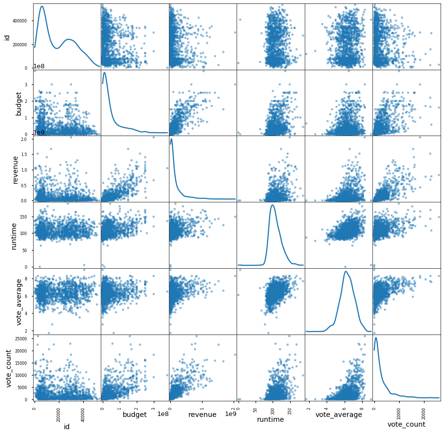

# ANNOUNCEMENTS - 06/05/20 Office Hours

- Home page (and google doc) updated with scheduling links/info
- Recurring 1:1s cancelled for the next 2 weeks (resume 06/22/20)
- Module 2 is unlocked. Next study group is on Section 11: Combinatorics & Probability 
- Info on exporting notebook as README has been added to the project Google Doc

___

## Final Project Submission

Please fill out:
* Student name: James Irving
* Student pace: part time
* Scheduled project review date/time: 
* Instructor name: Jeff Herman
* Blog post URL:


```python
# import  IPython.display as dp
# with open('README.md','r+', encoding='utf-8') as f:
#     dp.display(dp.Markdown(f.read()))
```

> ### Your team is charged with doing data analysis and creating a presentation that explores what type of films are currently doing the best at the box office. You must then translate those findings into actionable insights that the CEO can use when deciding what type of films they should be creating.


```python
# Your code here - remember to use markdown cells for comments as well!
# !pip install -U fsds
from fsds.imports import *
```

    
    Bad key "text.kerning_factor" on line 4 in
    /opt/anaconda3/envs/learn-env/lib/python3.6/site-packages/matplotlib/mpl-data/stylelib/_classic_test_patch.mplstyle.
    You probably need to get an updated matplotlibrc file from
    http://github.com/matplotlib/matplotlib/blob/master/matplotlibrc.template
    or from the matplotlib source distribution


    fsds v0.2.9 loaded.  Read the docs: https://fs-ds.readthedocs.io/en/latest/ 


<style  type="text/css" >
</style><table id="T_f52fb238_a77f_11ea_822c_4865ee12e626" ><caption>Loaded Packages and Handles</caption><thead>    <tr>        <th class="col_heading level0 col0" >Handle</th>        <th class="col_heading level0 col1" >Package</th>        <th class="col_heading level0 col2" >Description</th>    </tr></thead><tbody>
                <tr>
                                <td id="T_f52fb238_a77f_11ea_822c_4865ee12e626row0_col0" class="data row0 col0" >dp</td>
                        <td id="T_f52fb238_a77f_11ea_822c_4865ee12e626row0_col1" class="data row0 col1" >IPython.display</td>
                        <td id="T_f52fb238_a77f_11ea_822c_4865ee12e626row0_col2" class="data row0 col2" >Display modules with helpful display and clearing commands.</td>
            </tr>
            <tr>
                                <td id="T_f52fb238_a77f_11ea_822c_4865ee12e626row1_col0" class="data row1 col0" >fs</td>
                        <td id="T_f52fb238_a77f_11ea_822c_4865ee12e626row1_col1" class="data row1 col1" >fsds</td>
                        <td id="T_f52fb238_a77f_11ea_822c_4865ee12e626row1_col2" class="data row1 col2" >Custom data science bootcamp student package</td>
            </tr>
            <tr>
                                <td id="T_f52fb238_a77f_11ea_822c_4865ee12e626row2_col0" class="data row2 col0" >mpl</td>
                        <td id="T_f52fb238_a77f_11ea_822c_4865ee12e626row2_col1" class="data row2 col1" >matplotlib</td>
                        <td id="T_f52fb238_a77f_11ea_822c_4865ee12e626row2_col2" class="data row2 col2" >Matplotlib's base OOP module with formatting artists</td>
            </tr>
            <tr>
                                <td id="T_f52fb238_a77f_11ea_822c_4865ee12e626row3_col0" class="data row3 col0" >plt</td>
                        <td id="T_f52fb238_a77f_11ea_822c_4865ee12e626row3_col1" class="data row3 col1" >matplotlib.pyplot</td>
                        <td id="T_f52fb238_a77f_11ea_822c_4865ee12e626row3_col2" class="data row3 col2" >Matplotlib's matlab-like plotting module</td>
            </tr>
            <tr>
                                <td id="T_f52fb238_a77f_11ea_822c_4865ee12e626row4_col0" class="data row4 col0" >np</td>
                        <td id="T_f52fb238_a77f_11ea_822c_4865ee12e626row4_col1" class="data row4 col1" >numpy</td>
                        <td id="T_f52fb238_a77f_11ea_822c_4865ee12e626row4_col2" class="data row4 col2" >scientific computing with Python</td>
            </tr>
            <tr>
                                <td id="T_f52fb238_a77f_11ea_822c_4865ee12e626row5_col0" class="data row5 col0" >pd</td>
                        <td id="T_f52fb238_a77f_11ea_822c_4865ee12e626row5_col1" class="data row5 col1" >pandas</td>
                        <td id="T_f52fb238_a77f_11ea_822c_4865ee12e626row5_col2" class="data row5 col2" >High performance data structures and tools</td>
            </tr>
            <tr>
                                <td id="T_f52fb238_a77f_11ea_822c_4865ee12e626row6_col0" class="data row6 col0" >sns</td>
                        <td id="T_f52fb238_a77f_11ea_822c_4865ee12e626row6_col1" class="data row6 col1" >seaborn</td>
                        <td id="T_f52fb238_a77f_11ea_822c_4865ee12e626row6_col2" class="data row6 col2" >High-level data visualization library based on matplotlib</td>
            </tr>
    </tbody></table>


```python

```


```python
import os,glob
display(os.listdir('zippedData'))
```


    ['imdb.title.crew.csv.gz',
     'tmdb.movies.csv.gz',
     'imdb.title.akas.csv.gz',
     'imdb.title.ratings.csv.gz',
     'imdb.name.basics.csv.gz',
     'rt.reviews.tsv.gz',
     'imdb.title.basics.csv.gz',
     'rt.movie_info.tsv.gz',
     'tn.movie_budgets.csv.gz',
     'bom.movie_gross.csv.gz',
     'imdb.title.principals.csv.gz']


```python
files = glob.glob('zippedData/*')
files
```


    ['zippedData/imdb.title.crew.csv.gz',
     'zippedData/tmdb.movies.csv.gz',
     'zippedData/imdb.title.akas.csv.gz',
     'zippedData/imdb.title.ratings.csv.gz',
     'zippedData/imdb.name.basics.csv.gz',
     'zippedData/rt.reviews.tsv.gz',
     'zippedData/imdb.title.basics.csv.gz',
     'zippedData/rt.movie_info.tsv.gz',
     'zippedData/tn.movie_budgets.csv.gz',
     'zippedData/bom.movie_gross.csv.gz',
     'zippedData/imdb.title.principals.csv.gz']


```python
files = glob.glob('zippedData/*')
files
```


    ['zippedData/imdb.title.crew.csv.gz',
     'zippedData/tmdb.movies.csv.gz',
     'zippedData/imdb.title.akas.csv.gz',
     'zippedData/imdb.title.ratings.csv.gz',
     'zippedData/imdb.name.basics.csv.gz',
     'zippedData/rt.reviews.tsv.gz',
     'zippedData/imdb.title.basics.csv.gz',
     'zippedData/rt.movie_info.tsv.gz',
     'zippedData/tn.movie_budgets.csv.gz',
     'zippedData/bom.movie_gross.csv.gz',
     'zippedData/imdb.title.principals.csv.gz']


```python
os.path.split(files[0])[-1].replace('.csv.gz','')
```


    'imdb.title.crew'


```python
DATA = {}
for file in files:
    print(file)
    key = os.path.split(file)[-1].replace('.csv.gz','').replace('tsv.gz','')
    if ".tsv" in file:
        sep='\t'
        encode = 'latin-1'#'utf-8'
    else:
        sep=','
        encode='utf-8'
    DATA[key] = pd.read_csv(file,sep=sep,encoding=encode)#,index_col=0)
```

    zippedData/imdb.title.crew.csv.gz
    zippedData/tmdb.movies.csv.gz
    zippedData/imdb.title.akas.csv.gz
    zippedData/imdb.title.ratings.csv.gz
    zippedData/imdb.name.basics.csv.gz
    zippedData/rt.reviews.tsv.gz
    zippedData/imdb.title.basics.csv.gz
    zippedData/rt.movie_info.tsv.gz
    zippedData/tn.movie_budgets.csv.gz
    zippedData/bom.movie_gross.csv.gz
    zippedData/imdb.title.principals.csv.gz


# Preview Data

## Questions

- **Where are the gross box office numbers?**
    - rt.movie_info.
        - Key: ?
        
    - tn.movie_budgets
        - Key:
        
    - bom.movie_gross
        - Key: 
        
- **What website is that table from?**
    - What other tables are from the same source and can be joined easily?

- **What columns may require extensive pre-processing?**
    - Any Genre columns
        - `rt.movie.info.['genre']`


```python
for tablename, data in DATA.items():
#     print('---'*20+'\n'+f"{tablename}:")
    try:
        display(data.head(2).style.set_caption(f"{tablename}"))
        print(len(data))
    except:
        display(data.head(2).reset_index().style.set_caption(f"{tablename}"))
    print()
```


<style  type="text/css" >
</style><table id="T_f7d3ee14_a77f_11ea_b6a6_4865ee12e626" ><caption>imdb.title.crew</caption><thead>    <tr>        <th class="blank level0" ></th>        <th class="col_heading level0 col0" >tconst</th>        <th class="col_heading level0 col1" >directors</th>        <th class="col_heading level0 col2" >writers</th>    </tr></thead><tbody>
                <tr>
                        <th id="T_f7d3ee14_a77f_11ea_b6a6_4865ee12e626level0_row0" class="row_heading level0 row0" >0</th>
                        <td id="T_f7d3ee14_a77f_11ea_b6a6_4865ee12e626row0_col0" class="data row0 col0" >tt0285252</td>
                        <td id="T_f7d3ee14_a77f_11ea_b6a6_4865ee12e626row0_col1" class="data row0 col1" >nm0899854</td>
                        <td id="T_f7d3ee14_a77f_11ea_b6a6_4865ee12e626row0_col2" class="data row0 col2" >nm0899854</td>
            </tr>
            <tr>
                        <th id="T_f7d3ee14_a77f_11ea_b6a6_4865ee12e626level0_row1" class="row_heading level0 row1" >1</th>
                        <td id="T_f7d3ee14_a77f_11ea_b6a6_4865ee12e626row1_col0" class="data row1 col0" >tt0438973</td>
                        <td id="T_f7d3ee14_a77f_11ea_b6a6_4865ee12e626row1_col1" class="data row1 col1" >nan</td>
                        <td id="T_f7d3ee14_a77f_11ea_b6a6_4865ee12e626row1_col2" class="data row1 col2" >nm0175726,nm1802864</td>
            </tr>
    </tbody></table>


    146144
    


<style  type="text/css" >
</style><table id="T_f7d44ada_a77f_11ea_bb2d_4865ee12e626" ><caption>tmdb.movies</caption><thead>    <tr>        <th class="blank level0" ></th>        <th class="col_heading level0 col0" >Unnamed: 0</th>        <th class="col_heading level0 col1" >genre_ids</th>        <th class="col_heading level0 col2" >id</th>        <th class="col_heading level0 col3" >original_language</th>        <th class="col_heading level0 col4" >original_title</th>        <th class="col_heading level0 col5" >popularity</th>        <th class="col_heading level0 col6" >release_date</th>        <th class="col_heading level0 col7" >title</th>        <th class="col_heading level0 col8" >vote_average</th>        <th class="col_heading level0 col9" >vote_count</th>    </tr></thead><tbody>
                <tr>
                        <th id="T_f7d44ada_a77f_11ea_bb2d_4865ee12e626level0_row0" class="row_heading level0 row0" >0</th>
                        <td id="T_f7d44ada_a77f_11ea_bb2d_4865ee12e626row0_col0" class="data row0 col0" >0</td>
                        <td id="T_f7d44ada_a77f_11ea_bb2d_4865ee12e626row0_col1" class="data row0 col1" >[12, 14, 10751]</td>
                        <td id="T_f7d44ada_a77f_11ea_bb2d_4865ee12e626row0_col2" class="data row0 col2" >12444</td>
                        <td id="T_f7d44ada_a77f_11ea_bb2d_4865ee12e626row0_col3" class="data row0 col3" >en</td>
                        <td id="T_f7d44ada_a77f_11ea_bb2d_4865ee12e626row0_col4" class="data row0 col4" >Harry Potter and the Deathly Hallows: Part 1</td>
                        <td id="T_f7d44ada_a77f_11ea_bb2d_4865ee12e626row0_col5" class="data row0 col5" >33.533</td>
                        <td id="T_f7d44ada_a77f_11ea_bb2d_4865ee12e626row0_col6" class="data row0 col6" >2010-11-19</td>
                        <td id="T_f7d44ada_a77f_11ea_bb2d_4865ee12e626row0_col7" class="data row0 col7" >Harry Potter and the Deathly Hallows: Part 1</td>
                        <td id="T_f7d44ada_a77f_11ea_bb2d_4865ee12e626row0_col8" class="data row0 col8" >7.7</td>
                        <td id="T_f7d44ada_a77f_11ea_bb2d_4865ee12e626row0_col9" class="data row0 col9" >10788</td>
            </tr>
            <tr>
                        <th id="T_f7d44ada_a77f_11ea_bb2d_4865ee12e626level0_row1" class="row_heading level0 row1" >1</th>
                        <td id="T_f7d44ada_a77f_11ea_bb2d_4865ee12e626row1_col0" class="data row1 col0" >1</td>
                        <td id="T_f7d44ada_a77f_11ea_bb2d_4865ee12e626row1_col1" class="data row1 col1" >[14, 12, 16, 10751]</td>
                        <td id="T_f7d44ada_a77f_11ea_bb2d_4865ee12e626row1_col2" class="data row1 col2" >10191</td>
                        <td id="T_f7d44ada_a77f_11ea_bb2d_4865ee12e626row1_col3" class="data row1 col3" >en</td>
                        <td id="T_f7d44ada_a77f_11ea_bb2d_4865ee12e626row1_col4" class="data row1 col4" >How to Train Your Dragon</td>
                        <td id="T_f7d44ada_a77f_11ea_bb2d_4865ee12e626row1_col5" class="data row1 col5" >28.734</td>
                        <td id="T_f7d44ada_a77f_11ea_bb2d_4865ee12e626row1_col6" class="data row1 col6" >2010-03-26</td>
                        <td id="T_f7d44ada_a77f_11ea_bb2d_4865ee12e626row1_col7" class="data row1 col7" >How to Train Your Dragon</td>
                        <td id="T_f7d44ada_a77f_11ea_bb2d_4865ee12e626row1_col8" class="data row1 col8" >7.7</td>
                        <td id="T_f7d44ada_a77f_11ea_bb2d_4865ee12e626row1_col9" class="data row1 col9" >7610</td>
            </tr>
    </tbody></table>


    26517
    


<style  type="text/css" >
</style><table id="T_f7d4dbba_a77f_11ea_916b_4865ee12e626" ><caption>imdb.title.akas</caption><thead>    <tr>        <th class="blank level0" ></th>        <th class="col_heading level0 col0" >title_id</th>        <th class="col_heading level0 col1" >ordering</th>        <th class="col_heading level0 col2" >title</th>        <th class="col_heading level0 col3" >region</th>        <th class="col_heading level0 col4" >language</th>        <th class="col_heading level0 col5" >types</th>        <th class="col_heading level0 col6" >attributes</th>        <th class="col_heading level0 col7" >is_original_title</th>    </tr></thead><tbody>
                <tr>
                        <th id="T_f7d4dbba_a77f_11ea_916b_4865ee12e626level0_row0" class="row_heading level0 row0" >0</th>
                        <td id="T_f7d4dbba_a77f_11ea_916b_4865ee12e626row0_col0" class="data row0 col0" >tt0369610</td>
                        <td id="T_f7d4dbba_a77f_11ea_916b_4865ee12e626row0_col1" class="data row0 col1" >10</td>
                        <td id="T_f7d4dbba_a77f_11ea_916b_4865ee12e626row0_col2" class="data row0 col2" >Джурасик свят</td>
                        <td id="T_f7d4dbba_a77f_11ea_916b_4865ee12e626row0_col3" class="data row0 col3" >BG</td>
                        <td id="T_f7d4dbba_a77f_11ea_916b_4865ee12e626row0_col4" class="data row0 col4" >bg</td>
                        <td id="T_f7d4dbba_a77f_11ea_916b_4865ee12e626row0_col5" class="data row0 col5" >nan</td>
                        <td id="T_f7d4dbba_a77f_11ea_916b_4865ee12e626row0_col6" class="data row0 col6" >nan</td>
                        <td id="T_f7d4dbba_a77f_11ea_916b_4865ee12e626row0_col7" class="data row0 col7" >0</td>
            </tr>
            <tr>
                        <th id="T_f7d4dbba_a77f_11ea_916b_4865ee12e626level0_row1" class="row_heading level0 row1" >1</th>
                        <td id="T_f7d4dbba_a77f_11ea_916b_4865ee12e626row1_col0" class="data row1 col0" >tt0369610</td>
                        <td id="T_f7d4dbba_a77f_11ea_916b_4865ee12e626row1_col1" class="data row1 col1" >11</td>
                        <td id="T_f7d4dbba_a77f_11ea_916b_4865ee12e626row1_col2" class="data row1 col2" >Jurashikku warudo</td>
                        <td id="T_f7d4dbba_a77f_11ea_916b_4865ee12e626row1_col3" class="data row1 col3" >JP</td>
                        <td id="T_f7d4dbba_a77f_11ea_916b_4865ee12e626row1_col4" class="data row1 col4" >nan</td>
                        <td id="T_f7d4dbba_a77f_11ea_916b_4865ee12e626row1_col5" class="data row1 col5" >imdbDisplay</td>
                        <td id="T_f7d4dbba_a77f_11ea_916b_4865ee12e626row1_col6" class="data row1 col6" >nan</td>
                        <td id="T_f7d4dbba_a77f_11ea_916b_4865ee12e626row1_col7" class="data row1 col7" >0</td>
            </tr>
    </tbody></table>


    331703
    


<style  type="text/css" >
</style><table id="T_f7d54d06_a77f_11ea_bd35_4865ee12e626" ><caption>imdb.title.ratings</caption><thead>    <tr>        <th class="blank level0" ></th>        <th class="col_heading level0 col0" >tconst</th>        <th class="col_heading level0 col1" >averagerating</th>        <th class="col_heading level0 col2" >numvotes</th>    </tr></thead><tbody>
                <tr>
                        <th id="T_f7d54d06_a77f_11ea_bd35_4865ee12e626level0_row0" class="row_heading level0 row0" >0</th>
                        <td id="T_f7d54d06_a77f_11ea_bd35_4865ee12e626row0_col0" class="data row0 col0" >tt10356526</td>
                        <td id="T_f7d54d06_a77f_11ea_bd35_4865ee12e626row0_col1" class="data row0 col1" >8.3</td>
                        <td id="T_f7d54d06_a77f_11ea_bd35_4865ee12e626row0_col2" class="data row0 col2" >31</td>
            </tr>
            <tr>
                        <th id="T_f7d54d06_a77f_11ea_bd35_4865ee12e626level0_row1" class="row_heading level0 row1" >1</th>
                        <td id="T_f7d54d06_a77f_11ea_bd35_4865ee12e626row1_col0" class="data row1 col0" >tt10384606</td>
                        <td id="T_f7d54d06_a77f_11ea_bd35_4865ee12e626row1_col1" class="data row1 col1" >8.9</td>
                        <td id="T_f7d54d06_a77f_11ea_bd35_4865ee12e626row1_col2" class="data row1 col2" >559</td>
            </tr>
    </tbody></table>


    73856
    


<style  type="text/css" >
</style><table id="T_f7d5c09a_a77f_11ea_b4da_4865ee12e626" ><caption>imdb.name.basics</caption><thead>    <tr>        <th class="blank level0" ></th>        <th class="col_heading level0 col0" >nconst</th>        <th class="col_heading level0 col1" >primary_name</th>        <th class="col_heading level0 col2" >birth_year</th>        <th class="col_heading level0 col3" >death_year</th>        <th class="col_heading level0 col4" >primary_profession</th>        <th class="col_heading level0 col5" >known_for_titles</th>    </tr></thead><tbody>
                <tr>
                        <th id="T_f7d5c09a_a77f_11ea_b4da_4865ee12e626level0_row0" class="row_heading level0 row0" >0</th>
                        <td id="T_f7d5c09a_a77f_11ea_b4da_4865ee12e626row0_col0" class="data row0 col0" >nm0061671</td>
                        <td id="T_f7d5c09a_a77f_11ea_b4da_4865ee12e626row0_col1" class="data row0 col1" >Mary Ellen Bauder</td>
                        <td id="T_f7d5c09a_a77f_11ea_b4da_4865ee12e626row0_col2" class="data row0 col2" >nan</td>
                        <td id="T_f7d5c09a_a77f_11ea_b4da_4865ee12e626row0_col3" class="data row0 col3" >nan</td>
                        <td id="T_f7d5c09a_a77f_11ea_b4da_4865ee12e626row0_col4" class="data row0 col4" >miscellaneous,production_manager,producer</td>
                        <td id="T_f7d5c09a_a77f_11ea_b4da_4865ee12e626row0_col5" class="data row0 col5" >tt0837562,tt2398241,tt0844471,tt0118553</td>
            </tr>
            <tr>
                        <th id="T_f7d5c09a_a77f_11ea_b4da_4865ee12e626level0_row1" class="row_heading level0 row1" >1</th>
                        <td id="T_f7d5c09a_a77f_11ea_b4da_4865ee12e626row1_col0" class="data row1 col0" >nm0061865</td>
                        <td id="T_f7d5c09a_a77f_11ea_b4da_4865ee12e626row1_col1" class="data row1 col1" >Joseph Bauer</td>
                        <td id="T_f7d5c09a_a77f_11ea_b4da_4865ee12e626row1_col2" class="data row1 col2" >nan</td>
                        <td id="T_f7d5c09a_a77f_11ea_b4da_4865ee12e626row1_col3" class="data row1 col3" >nan</td>
                        <td id="T_f7d5c09a_a77f_11ea_b4da_4865ee12e626row1_col4" class="data row1 col4" >composer,music_department,sound_department</td>
                        <td id="T_f7d5c09a_a77f_11ea_b4da_4865ee12e626row1_col5" class="data row1 col5" >tt0896534,tt6791238,tt0287072,tt1682940</td>
            </tr>
    </tbody></table>


    606648
    


<style  type="text/css" >
</style><table id="T_f7d6483a_a77f_11ea_9f84_4865ee12e626" ><caption>rt.reviews.</caption><thead>    <tr>        <th class="blank level0" ></th>        <th class="col_heading level0 col0" >id</th>        <th class="col_heading level0 col1" >review</th>        <th class="col_heading level0 col2" >rating</th>        <th class="col_heading level0 col3" >fresh</th>        <th class="col_heading level0 col4" >critic</th>        <th class="col_heading level0 col5" >top_critic</th>        <th class="col_heading level0 col6" >publisher</th>        <th class="col_heading level0 col7" >date</th>    </tr></thead><tbody>
                <tr>
                        <th id="T_f7d6483a_a77f_11ea_9f84_4865ee12e626level0_row0" class="row_heading level0 row0" >0</th>
                        <td id="T_f7d6483a_a77f_11ea_9f84_4865ee12e626row0_col0" class="data row0 col0" >3</td>
                        <td id="T_f7d6483a_a77f_11ea_9f84_4865ee12e626row0_col1" class="data row0 col1" >A distinctly gallows take on contemporary financial mores, as one absurdly rich man's limo ride across town for a haircut functions as a state-of-the-nation discourse. </td>
                        <td id="T_f7d6483a_a77f_11ea_9f84_4865ee12e626row0_col2" class="data row0 col2" >3/5</td>
                        <td id="T_f7d6483a_a77f_11ea_9f84_4865ee12e626row0_col3" class="data row0 col3" >fresh</td>
                        <td id="T_f7d6483a_a77f_11ea_9f84_4865ee12e626row0_col4" class="data row0 col4" >PJ Nabarro</td>
                        <td id="T_f7d6483a_a77f_11ea_9f84_4865ee12e626row0_col5" class="data row0 col5" >0</td>
                        <td id="T_f7d6483a_a77f_11ea_9f84_4865ee12e626row0_col6" class="data row0 col6" >Patrick Nabarro</td>
                        <td id="T_f7d6483a_a77f_11ea_9f84_4865ee12e626row0_col7" class="data row0 col7" >November 10, 2018</td>
            </tr>
            <tr>
                        <th id="T_f7d6483a_a77f_11ea_9f84_4865ee12e626level0_row1" class="row_heading level0 row1" >1</th>
                        <td id="T_f7d6483a_a77f_11ea_9f84_4865ee12e626row1_col0" class="data row1 col0" >3</td>
                        <td id="T_f7d6483a_a77f_11ea_9f84_4865ee12e626row1_col1" class="data row1 col1" >It's an allegory in search of a meaning that never arrives...It's just old-fashioned bad storytelling.</td>
                        <td id="T_f7d6483a_a77f_11ea_9f84_4865ee12e626row1_col2" class="data row1 col2" >nan</td>
                        <td id="T_f7d6483a_a77f_11ea_9f84_4865ee12e626row1_col3" class="data row1 col3" >rotten</td>
                        <td id="T_f7d6483a_a77f_11ea_9f84_4865ee12e626row1_col4" class="data row1 col4" >Annalee Newitz</td>
                        <td id="T_f7d6483a_a77f_11ea_9f84_4865ee12e626row1_col5" class="data row1 col5" >0</td>
                        <td id="T_f7d6483a_a77f_11ea_9f84_4865ee12e626row1_col6" class="data row1 col6" >io9.com</td>
                        <td id="T_f7d6483a_a77f_11ea_9f84_4865ee12e626row1_col7" class="data row1 col7" >May 23, 2018</td>
            </tr>
    </tbody></table>


    54432
    


<style  type="text/css" >
</style><table id="T_f7d6d306_a77f_11ea_bd50_4865ee12e626" ><caption>imdb.title.basics</caption><thead>    <tr>        <th class="blank level0" ></th>        <th class="col_heading level0 col0" >tconst</th>        <th class="col_heading level0 col1" >primary_title</th>        <th class="col_heading level0 col2" >original_title</th>        <th class="col_heading level0 col3" >start_year</th>        <th class="col_heading level0 col4" >runtime_minutes</th>        <th class="col_heading level0 col5" >genres</th>    </tr></thead><tbody>
                <tr>
                        <th id="T_f7d6d306_a77f_11ea_bd50_4865ee12e626level0_row0" class="row_heading level0 row0" >0</th>
                        <td id="T_f7d6d306_a77f_11ea_bd50_4865ee12e626row0_col0" class="data row0 col0" >tt0063540</td>
                        <td id="T_f7d6d306_a77f_11ea_bd50_4865ee12e626row0_col1" class="data row0 col1" >Sunghursh</td>
                        <td id="T_f7d6d306_a77f_11ea_bd50_4865ee12e626row0_col2" class="data row0 col2" >Sunghursh</td>
                        <td id="T_f7d6d306_a77f_11ea_bd50_4865ee12e626row0_col3" class="data row0 col3" >2013</td>
                        <td id="T_f7d6d306_a77f_11ea_bd50_4865ee12e626row0_col4" class="data row0 col4" >175</td>
                        <td id="T_f7d6d306_a77f_11ea_bd50_4865ee12e626row0_col5" class="data row0 col5" >Action,Crime,Drama</td>
            </tr>
            <tr>
                        <th id="T_f7d6d306_a77f_11ea_bd50_4865ee12e626level0_row1" class="row_heading level0 row1" >1</th>
                        <td id="T_f7d6d306_a77f_11ea_bd50_4865ee12e626row1_col0" class="data row1 col0" >tt0066787</td>
                        <td id="T_f7d6d306_a77f_11ea_bd50_4865ee12e626row1_col1" class="data row1 col1" >One Day Before the Rainy Season</td>
                        <td id="T_f7d6d306_a77f_11ea_bd50_4865ee12e626row1_col2" class="data row1 col2" >Ashad Ka Ek Din</td>
                        <td id="T_f7d6d306_a77f_11ea_bd50_4865ee12e626row1_col3" class="data row1 col3" >2019</td>
                        <td id="T_f7d6d306_a77f_11ea_bd50_4865ee12e626row1_col4" class="data row1 col4" >114</td>
                        <td id="T_f7d6d306_a77f_11ea_bd50_4865ee12e626row1_col5" class="data row1 col5" >Biography,Drama</td>
            </tr>
    </tbody></table>


    146144
    


<style  type="text/css" >
</style><table id="T_f7d74cf8_a77f_11ea_bf0c_4865ee12e626" ><caption>rt.movie_info.</caption><thead>    <tr>        <th class="blank level0" ></th>        <th class="col_heading level0 col0" >id</th>        <th class="col_heading level0 col1" >synopsis</th>        <th class="col_heading level0 col2" >rating</th>        <th class="col_heading level0 col3" >genre</th>        <th class="col_heading level0 col4" >director</th>        <th class="col_heading level0 col5" >writer</th>        <th class="col_heading level0 col6" >theater_date</th>        <th class="col_heading level0 col7" >dvd_date</th>        <th class="col_heading level0 col8" >currency</th>        <th class="col_heading level0 col9" >box_office</th>        <th class="col_heading level0 col10" >runtime</th>        <th class="col_heading level0 col11" >studio</th>    </tr></thead><tbody>
                <tr>
                        <th id="T_f7d74cf8_a77f_11ea_bf0c_4865ee12e626level0_row0" class="row_heading level0 row0" >0</th>
                        <td id="T_f7d74cf8_a77f_11ea_bf0c_4865ee12e626row0_col0" class="data row0 col0" >1</td>
                        <td id="T_f7d74cf8_a77f_11ea_bf0c_4865ee12e626row0_col1" class="data row0 col1" >This gritty, fast-paced, and innovative police drama earned five Academy Awards, including Best Picture, Best Adapted Screenplay (written by Ernest Tidyman), and Best Actor (Gene Hackman). Jimmy "Popeye" Doyle (Hackman) and his partner, Buddy Russo (Roy Scheider), are New York City police detectives on narcotics detail, trying to track down the source of heroin from Europe into the United States. Suave Alain Charnier (Fernando Rey) is the French drug kingpin who provides a large percentage of New York City's dope, and Pierre Nicoli (Marcel Bozzuffi) is a hired killer and Charnier's right-hand man. Acting on a hunch, Popeye and Buddy start tailing Sal Boca (Tony Lo Bianco) and his wife, Angie (Arlene Faber), who live pretty high for a couple whose corner store brings in about 7,000 dollars a year. It turns out Popeye's suspicions are right -- Sal and Angie are the New York agents for Charnier, who will be smuggling 32 million dollars' worth of heroin into the city in a car shipped over from France. The French Connection broke plenty of new ground for screen thrillers; Popeye Doyle was a highly unusual "hero," an often violent, racist, and mean-spirited cop whose dedication to his job fell just short of dangerous obsession. The film's high point, a high-speed car chase with Popeye tailing an elevated train, was one of the most viscerally exciting screen moments of its day and set the stage for dozens of action sequences to follow. And the film's grimy realism (and downbeat ending) was a big change from the buff-and-shine gloss and good-guys-always-win heroics of most police dramas that preceded it. The French Connection was inspired by a true story, and Eddie Egan and Sonny Grosso, Popeye and Buddy's real life counterparts, both have small roles in the film. A sequel followed four years later.</td>
                        <td id="T_f7d74cf8_a77f_11ea_bf0c_4865ee12e626row0_col2" class="data row0 col2" >R</td>
                        <td id="T_f7d74cf8_a77f_11ea_bf0c_4865ee12e626row0_col3" class="data row0 col3" >Action and Adventure|Classics|Drama</td>
                        <td id="T_f7d74cf8_a77f_11ea_bf0c_4865ee12e626row0_col4" class="data row0 col4" >William Friedkin</td>
                        <td id="T_f7d74cf8_a77f_11ea_bf0c_4865ee12e626row0_col5" class="data row0 col5" >Ernest Tidyman</td>
                        <td id="T_f7d74cf8_a77f_11ea_bf0c_4865ee12e626row0_col6" class="data row0 col6" >Oct 9, 1971</td>
                        <td id="T_f7d74cf8_a77f_11ea_bf0c_4865ee12e626row0_col7" class="data row0 col7" >Sep 25, 2001</td>
                        <td id="T_f7d74cf8_a77f_11ea_bf0c_4865ee12e626row0_col8" class="data row0 col8" >nan</td>
                        <td id="T_f7d74cf8_a77f_11ea_bf0c_4865ee12e626row0_col9" class="data row0 col9" >nan</td>
                        <td id="T_f7d74cf8_a77f_11ea_bf0c_4865ee12e626row0_col10" class="data row0 col10" >104 minutes</td>
                        <td id="T_f7d74cf8_a77f_11ea_bf0c_4865ee12e626row0_col11" class="data row0 col11" >nan</td>
            </tr>
            <tr>
                        <th id="T_f7d74cf8_a77f_11ea_bf0c_4865ee12e626level0_row1" class="row_heading level0 row1" >1</th>
                        <td id="T_f7d74cf8_a77f_11ea_bf0c_4865ee12e626row1_col0" class="data row1 col0" >3</td>
                        <td id="T_f7d74cf8_a77f_11ea_bf0c_4865ee12e626row1_col1" class="data row1 col1" >New York City, not-too-distant-future: Eric Packer, a 28 year-old finance golden boy dreaming of living in a civilization ahead of this one, watches a dark shadow cast over the firmament of the Wall Street galaxy, of which he is the uncontested king. As he is chauffeured across midtown Manhattan to get a haircut at his father's old barber, his anxious eyes are glued to the yuan's exchange rate: it is mounting against all expectations, destroying Eric's bet against it. Eric Packer is losing his empire with every tick of the clock. Meanwhile, an eruption of wild activity unfolds in the city's streets. Petrified as the threats of the real world infringe upon his cloud of virtual convictions, his paranoia intensifies during the course of his 24-hour cross-town odyssey. Packer starts to piece together clues that lead him to a most terrifying secret: his imminent assassination. -- (C) Official Site</td>
                        <td id="T_f7d74cf8_a77f_11ea_bf0c_4865ee12e626row1_col2" class="data row1 col2" >R</td>
                        <td id="T_f7d74cf8_a77f_11ea_bf0c_4865ee12e626row1_col3" class="data row1 col3" >Drama|Science Fiction and Fantasy</td>
                        <td id="T_f7d74cf8_a77f_11ea_bf0c_4865ee12e626row1_col4" class="data row1 col4" >David Cronenberg</td>
                        <td id="T_f7d74cf8_a77f_11ea_bf0c_4865ee12e626row1_col5" class="data row1 col5" >David Cronenberg|Don DeLillo</td>
                        <td id="T_f7d74cf8_a77f_11ea_bf0c_4865ee12e626row1_col6" class="data row1 col6" >Aug 17, 2012</td>
                        <td id="T_f7d74cf8_a77f_11ea_bf0c_4865ee12e626row1_col7" class="data row1 col7" >Jan 1, 2013</td>
                        <td id="T_f7d74cf8_a77f_11ea_bf0c_4865ee12e626row1_col8" class="data row1 col8" >$</td>
                        <td id="T_f7d74cf8_a77f_11ea_bf0c_4865ee12e626row1_col9" class="data row1 col9" >600,000</td>
                        <td id="T_f7d74cf8_a77f_11ea_bf0c_4865ee12e626row1_col10" class="data row1 col10" >108 minutes</td>
                        <td id="T_f7d74cf8_a77f_11ea_bf0c_4865ee12e626row1_col11" class="data row1 col11" >Entertainment One</td>
            </tr>
    </tbody></table>


    1560
    


<style  type="text/css" >
</style><table id="T_f7d7f162_a77f_11ea_ad4d_4865ee12e626" ><caption>tn.movie_budgets</caption><thead>    <tr>        <th class="blank level0" ></th>        <th class="col_heading level0 col0" >id</th>        <th class="col_heading level0 col1" >release_date</th>        <th class="col_heading level0 col2" >movie</th>        <th class="col_heading level0 col3" >production_budget</th>        <th class="col_heading level0 col4" >domestic_gross</th>        <th class="col_heading level0 col5" >worldwide_gross</th>    </tr></thead><tbody>
                <tr>
                        <th id="T_f7d7f162_a77f_11ea_ad4d_4865ee12e626level0_row0" class="row_heading level0 row0" >0</th>
                        <td id="T_f7d7f162_a77f_11ea_ad4d_4865ee12e626row0_col0" class="data row0 col0" >1</td>
                        <td id="T_f7d7f162_a77f_11ea_ad4d_4865ee12e626row0_col1" class="data row0 col1" >Dec 18, 2009</td>
                        <td id="T_f7d7f162_a77f_11ea_ad4d_4865ee12e626row0_col2" class="data row0 col2" >Avatar</td>
                        <td id="T_f7d7f162_a77f_11ea_ad4d_4865ee12e626row0_col3" class="data row0 col3" >$425,000,000</td>
                        <td id="T_f7d7f162_a77f_11ea_ad4d_4865ee12e626row0_col4" class="data row0 col4" >$760,507,625</td>
                        <td id="T_f7d7f162_a77f_11ea_ad4d_4865ee12e626row0_col5" class="data row0 col5" >$2,776,345,279</td>
            </tr>
            <tr>
                        <th id="T_f7d7f162_a77f_11ea_ad4d_4865ee12e626level0_row1" class="row_heading level0 row1" >1</th>
                        <td id="T_f7d7f162_a77f_11ea_ad4d_4865ee12e626row1_col0" class="data row1 col0" >2</td>
                        <td id="T_f7d7f162_a77f_11ea_ad4d_4865ee12e626row1_col1" class="data row1 col1" >May 20, 2011</td>
                        <td id="T_f7d7f162_a77f_11ea_ad4d_4865ee12e626row1_col2" class="data row1 col2" >Pirates of the Caribbean: On Stranger Tides</td>
                        <td id="T_f7d7f162_a77f_11ea_ad4d_4865ee12e626row1_col3" class="data row1 col3" >$410,600,000</td>
                        <td id="T_f7d7f162_a77f_11ea_ad4d_4865ee12e626row1_col4" class="data row1 col4" >$241,063,875</td>
                        <td id="T_f7d7f162_a77f_11ea_ad4d_4865ee12e626row1_col5" class="data row1 col5" >$1,045,663,875</td>
            </tr>
    </tbody></table>


    5782
    


<style  type="text/css" >
</style><table id="T_f7d88886_a77f_11ea_a083_4865ee12e626" ><caption>bom.movie_gross</caption><thead>    <tr>        <th class="blank level0" ></th>        <th class="col_heading level0 col0" >title</th>        <th class="col_heading level0 col1" >studio</th>        <th class="col_heading level0 col2" >domestic_gross</th>        <th class="col_heading level0 col3" >foreign_gross</th>        <th class="col_heading level0 col4" >year</th>    </tr></thead><tbody>
                <tr>
                        <th id="T_f7d88886_a77f_11ea_a083_4865ee12e626level0_row0" class="row_heading level0 row0" >0</th>
                        <td id="T_f7d88886_a77f_11ea_a083_4865ee12e626row0_col0" class="data row0 col0" >Toy Story 3</td>
                        <td id="T_f7d88886_a77f_11ea_a083_4865ee12e626row0_col1" class="data row0 col1" >BV</td>
                        <td id="T_f7d88886_a77f_11ea_a083_4865ee12e626row0_col2" class="data row0 col2" >4.15e+08</td>
                        <td id="T_f7d88886_a77f_11ea_a083_4865ee12e626row0_col3" class="data row0 col3" >652000000</td>
                        <td id="T_f7d88886_a77f_11ea_a083_4865ee12e626row0_col4" class="data row0 col4" >2010</td>
            </tr>
            <tr>
                        <th id="T_f7d88886_a77f_11ea_a083_4865ee12e626level0_row1" class="row_heading level0 row1" >1</th>
                        <td id="T_f7d88886_a77f_11ea_a083_4865ee12e626row1_col0" class="data row1 col0" >Alice in Wonderland (2010)</td>
                        <td id="T_f7d88886_a77f_11ea_a083_4865ee12e626row1_col1" class="data row1 col1" >BV</td>
                        <td id="T_f7d88886_a77f_11ea_a083_4865ee12e626row1_col2" class="data row1 col2" >3.342e+08</td>
                        <td id="T_f7d88886_a77f_11ea_a083_4865ee12e626row1_col3" class="data row1 col3" >691300000</td>
                        <td id="T_f7d88886_a77f_11ea_a083_4865ee12e626row1_col4" class="data row1 col4" >2010</td>
            </tr>
    </tbody></table>


    3387
    


<style  type="text/css" >
</style><table id="T_f7d909b4_a77f_11ea_9517_4865ee12e626" ><caption>imdb.title.principals</caption><thead>    <tr>        <th class="blank level0" ></th>        <th class="col_heading level0 col0" >tconst</th>        <th class="col_heading level0 col1" >ordering</th>        <th class="col_heading level0 col2" >nconst</th>        <th class="col_heading level0 col3" >category</th>        <th class="col_heading level0 col4" >job</th>        <th class="col_heading level0 col5" >characters</th>    </tr></thead><tbody>
                <tr>
                        <th id="T_f7d909b4_a77f_11ea_9517_4865ee12e626level0_row0" class="row_heading level0 row0" >0</th>
                        <td id="T_f7d909b4_a77f_11ea_9517_4865ee12e626row0_col0" class="data row0 col0" >tt0111414</td>
                        <td id="T_f7d909b4_a77f_11ea_9517_4865ee12e626row0_col1" class="data row0 col1" >1</td>
                        <td id="T_f7d909b4_a77f_11ea_9517_4865ee12e626row0_col2" class="data row0 col2" >nm0246005</td>
                        <td id="T_f7d909b4_a77f_11ea_9517_4865ee12e626row0_col3" class="data row0 col3" >actor</td>
                        <td id="T_f7d909b4_a77f_11ea_9517_4865ee12e626row0_col4" class="data row0 col4" >nan</td>
                        <td id="T_f7d909b4_a77f_11ea_9517_4865ee12e626row0_col5" class="data row0 col5" >["The Man"]</td>
            </tr>
            <tr>
                        <th id="T_f7d909b4_a77f_11ea_9517_4865ee12e626level0_row1" class="row_heading level0 row1" >1</th>
                        <td id="T_f7d909b4_a77f_11ea_9517_4865ee12e626row1_col0" class="data row1 col0" >tt0111414</td>
                        <td id="T_f7d909b4_a77f_11ea_9517_4865ee12e626row1_col1" class="data row1 col1" >2</td>
                        <td id="T_f7d909b4_a77f_11ea_9517_4865ee12e626row1_col2" class="data row1 col2" >nm0398271</td>
                        <td id="T_f7d909b4_a77f_11ea_9517_4865ee12e626row1_col3" class="data row1 col3" >director</td>
                        <td id="T_f7d909b4_a77f_11ea_9517_4865ee12e626row1_col4" class="data row1 col4" >nan</td>
                        <td id="T_f7d909b4_a77f_11ea_9517_4865ee12e626row1_col5" class="data row1 col5" >nan</td>
            </tr>
    </tbody></table>


    1028186
    


## Fast Forward

- Used the tmdb api to extract movie info using the ids from the tmdb.movies table


```python
df = pd.read_csv("__api_results_combined.csv",parse_dates=['release_date','release_date_cert'],index_col=0)
df.reset_index(drop=True,inplace=True)
df.head()
```


<div>
<style scoped>
    .dataframe tbody tr th:only-of-type {
        vertical-align: middle;
    }

    .dataframe tbody tr th {
        vertical-align: top;
    }

    .dataframe thead th {
        text-align: right;
    }
</style>
<table border="1" class="dataframe">
  <thead>
    <tr style="text-align: right;">
      <th></th>
      <th>id</th>
      <th>rating</th>
      <th>release_date_cert</th>
      <th>imdb_id</th>
      <th>title</th>
      <th>budget</th>
      <th>release_date</th>
      <th>revenue</th>
      <th>runtime</th>
      <th>original_language</th>
      <th>original_title</th>
      <th>vote_average</th>
      <th>vote_count</th>
      <th>poster_path</th>
      <th>genres_id</th>
      <th>genres_name</th>
      <th>spoken_languages_name</th>
      <th>production_companies_id</th>
      <th>production_companies_name</th>
      <th>production_companies_origin_country</th>
    </tr>
  </thead>
  <tbody>
    <tr>
      <td>0</td>
      <td>116977</td>
      <td>PG</td>
      <td>2013-05-07 00:00:00+00:00</td>
      <td>tt0249516</td>
      <td>Foodfight!</td>
      <td>65000000</td>
      <td>2012-06-15</td>
      <td>73706</td>
      <td>87.0</td>
      <td>en</td>
      <td>Foodfight!</td>
      <td>1.7</td>
      <td>76</td>
      <td>/R1zn75Yz4wpdd85byqhP7mT6No.jpg</td>
      <td>[16, 28, 35, 10751]</td>
      <td>['Animation', 'Action', 'Comedy', 'Family']</td>
      <td>['English']</td>
      <td>[4174, 1632, 133802, 133803, 133804]</td>
      <td>['Threshold Entertainment', 'Lionsgate', 'C47 ...</td>
      <td>['', 'US', '', '', '']</td>
    </tr>
    <tr>
      <td>1</td>
      <td>308024</td>
      <td>R</td>
      <td>2015-01-23 00:00:00+00:00</td>
      <td>tt3844362</td>
      <td>The Overnight</td>
      <td>0</td>
      <td>2015-06-19</td>
      <td>1100000</td>
      <td>80.0</td>
      <td>en</td>
      <td>The Overnight</td>
      <td>6.0</td>
      <td>222</td>
      <td>/65L466UR3h1jw8mTJhGmMZlj0eT.jpg</td>
      <td>[9648, 35]</td>
      <td>['Mystery', 'Comedy']</td>
      <td>['English', 'Français']</td>
      <td>[1974, 63631]</td>
      <td>['Duplass Brothers Productions', "Gettin' Rad ...</td>
      <td>['US', '']</td>
    </tr>
    <tr>
      <td>2</td>
      <td>83770</td>
      <td>R</td>
      <td>2012-12-21 00:00:00+00:00</td>
      <td>tt0337692</td>
      <td>On the Road</td>
      <td>25000000</td>
      <td>2012-05-22</td>
      <td>8784318</td>
      <td>137.0</td>
      <td>en</td>
      <td>On the Road</td>
      <td>5.6</td>
      <td>600</td>
      <td>/k7LQteD02p3VHixbS6NXHkFdFwT.jpg</td>
      <td>[12, 18]</td>
      <td>['Adventure', 'Drama']</td>
      <td>['English', 'Français']</td>
      <td>[8372, 70, 79077, 614, 83, 10611, 346, 21914, ...</td>
      <td>['SPAD Films', 'American Zoetrope', 'Jerry Lei...</td>
      <td>['', 'US', '', '', 'FR', 'FR', 'BR', 'AR', 'CA...</td>
    </tr>
    <tr>
      <td>3</td>
      <td>116745</td>
      <td>PG</td>
      <td>2013-12-25 00:00:00+00:00</td>
      <td>tt0359950</td>
      <td>The Secret Life of Walter Mitty</td>
      <td>90000000</td>
      <td>2013-12-18</td>
      <td>188133322</td>
      <td>114.0</td>
      <td>en</td>
      <td>The Secret Life of Walter Mitty</td>
      <td>7.1</td>
      <td>5561</td>
      <td>/tY6ypjKOOtujhxiSwTmvA4OZ5IE.jpg</td>
      <td>[12, 35, 18, 14]</td>
      <td>['Adventure', 'Comedy', 'Drama', 'Fantasy']</td>
      <td>['English']</td>
      <td>[290, 22213, 9118, 12, 10893, 37336, 25, 2932]</td>
      <td>['Ingenious Media', 'TSG Entertainment', 'Samu...</td>
      <td>['GB', 'US', 'US', 'US', '', '', 'US', 'US']</td>
    </tr>
    <tr>
      <td>4</td>
      <td>169917</td>
      <td>R</td>
      <td>2014-09-19 00:00:00+00:00</td>
      <td>tt0365907</td>
      <td>A Walk Among the Tombstones</td>
      <td>28000000</td>
      <td>2014-09-18</td>
      <td>53181600</td>
      <td>113.0</td>
      <td>en</td>
      <td>A Walk Among the Tombstones</td>
      <td>6.3</td>
      <td>1926</td>
      <td>/bQTHTZezSudf27mMQtedHf1XpgO.jpg</td>
      <td>[80, 18, 9648, 53]</td>
      <td>['Crime', 'Drama', 'Mystery', 'Thriller']</td>
      <td>['English']</td>
      <td>[39043, 216, 40106, 11448, 10246, 8532, 40107,...</td>
      <td>['Traveling Picture Show Company (TPSC)', 'Jer...</td>
      <td>['', '', '', 'US', 'US', '', '', '']</td>
    </tr>
  </tbody>
</table>
</div>


```python

```


```python
df.info()
```

    <class 'pandas.core.frame.DataFrame'>
    RangeIndex: 1586 entries, 0 to 1585
    Data columns (total 20 columns):
    id                                     1586 non-null int64
    rating                                 1431 non-null object
    release_date_cert                      1584 non-null datetime64[ns, UTC]
    imdb_id                                1583 non-null object
    title                                  1586 non-null object
    budget                                 1586 non-null int64
    release_date                           1586 non-null datetime64[ns]
    revenue                                1586 non-null int64
    runtime                                1583 non-null float64
    original_language                      1586 non-null object
    original_title                         1586 non-null object
    vote_average                           1586 non-null float64
    vote_count                             1586 non-null int64
    poster_path                            1533 non-null object
    genres_id                              1586 non-null object
    genres_name                            1586 non-null object
    spoken_languages_name                  1586 non-null object
    production_companies_id                1586 non-null object
    production_companies_name              1586 non-null object
    production_companies_origin_country    1586 non-null object
    dtypes: datetime64[ns, UTC](1), datetime64[ns](1), float64(2), int64(4), object(12)
    memory usage: 247.9+ KB


```python
import missingno as ms
ms.matrix(df)
```


    <matplotlib.axes._subplots.AxesSubplot at 0x135094e48>


```python
df.isna().sum()
```


    id                                       0
    rating                                 155
    release_date_cert                        2
    imdb_id                                  3
    title                                    0
    budget                                   0
    release_date                             0
    revenue                                  0
    runtime                                  3
    original_language                        0
    original_title                           0
    vote_average                             0
    vote_count                               0
    poster_path                             53
    genres_id                                0
    genres_name                              0
    spoken_languages_name                    0
    production_companies_id                  0
    production_companies_name                0
    production_companies_origin_country      0
    dtype: int64


```python
df.dropna(subset=['rating','imdb_id'],inplace=True)
df.isna().sum()
```


    id                                     0
    rating                                 0
    release_date_cert                      0
    imdb_id                                0
    title                                  0
    budget                                 0
    release_date                           0
    revenue                                0
    runtime                                0
    original_language                      0
    original_title                         0
    vote_average                           0
    vote_count                             0
    poster_path                            8
    genres_id                              0
    genres_name                            0
    spoken_languages_name                  0
    production_companies_id                0
    production_companies_name              0
    production_companies_origin_country    0
    dtype: int64


```python
df.reset_index(drop=True,inplace=True)
df
```


<div>
<style scoped>
    .dataframe tbody tr th:only-of-type {
        vertical-align: middle;
    }

    .dataframe tbody tr th {
        vertical-align: top;
    }

    .dataframe thead th {
        text-align: right;
    }
</style>
<table border="1" class="dataframe">
  <thead>
    <tr style="text-align: right;">
      <th></th>
      <th>id</th>
      <th>rating</th>
      <th>release_date_cert</th>
      <th>imdb_id</th>
      <th>title</th>
      <th>budget</th>
      <th>release_date</th>
      <th>revenue</th>
      <th>runtime</th>
      <th>original_language</th>
      <th>original_title</th>
      <th>vote_average</th>
      <th>vote_count</th>
      <th>poster_path</th>
      <th>genres_id</th>
      <th>genres_name</th>
      <th>spoken_languages_name</th>
      <th>production_companies_id</th>
      <th>production_companies_name</th>
      <th>production_companies_origin_country</th>
    </tr>
  </thead>
  <tbody>
    <tr>
      <td>0</td>
      <td>116977</td>
      <td>PG</td>
      <td>2013-05-07 00:00:00+00:00</td>
      <td>tt0249516</td>
      <td>Foodfight!</td>
      <td>65000000</td>
      <td>2012-06-15</td>
      <td>73706</td>
      <td>87.0</td>
      <td>en</td>
      <td>Foodfight!</td>
      <td>1.7</td>
      <td>76</td>
      <td>/R1zn75Yz4wpdd85byqhP7mT6No.jpg</td>
      <td>[16, 28, 35, 10751]</td>
      <td>['Animation', 'Action', 'Comedy', 'Family']</td>
      <td>['English']</td>
      <td>[4174, 1632, 133802, 133803, 133804]</td>
      <td>['Threshold Entertainment', 'Lionsgate', 'C47 ...</td>
      <td>['', 'US', '', '', '']</td>
    </tr>
    <tr>
      <td>1</td>
      <td>308024</td>
      <td>R</td>
      <td>2015-01-23 00:00:00+00:00</td>
      <td>tt3844362</td>
      <td>The Overnight</td>
      <td>0</td>
      <td>2015-06-19</td>
      <td>1100000</td>
      <td>80.0</td>
      <td>en</td>
      <td>The Overnight</td>
      <td>6.0</td>
      <td>222</td>
      <td>/65L466UR3h1jw8mTJhGmMZlj0eT.jpg</td>
      <td>[9648, 35]</td>
      <td>['Mystery', 'Comedy']</td>
      <td>['English', 'Français']</td>
      <td>[1974, 63631]</td>
      <td>['Duplass Brothers Productions', "Gettin' Rad ...</td>
      <td>['US', '']</td>
    </tr>
    <tr>
      <td>2</td>
      <td>83770</td>
      <td>R</td>
      <td>2012-12-21 00:00:00+00:00</td>
      <td>tt0337692</td>
      <td>On the Road</td>
      <td>25000000</td>
      <td>2012-05-22</td>
      <td>8784318</td>
      <td>137.0</td>
      <td>en</td>
      <td>On the Road</td>
      <td>5.6</td>
      <td>600</td>
      <td>/k7LQteD02p3VHixbS6NXHkFdFwT.jpg</td>
      <td>[12, 18]</td>
      <td>['Adventure', 'Drama']</td>
      <td>['English', 'Français']</td>
      <td>[8372, 70, 79077, 614, 83, 10611, 346, 21914, ...</td>
      <td>['SPAD Films', 'American Zoetrope', 'Jerry Lei...</td>
      <td>['', 'US', '', '', 'FR', 'FR', 'BR', 'AR', 'CA...</td>
    </tr>
    <tr>
      <td>3</td>
      <td>116745</td>
      <td>PG</td>
      <td>2013-12-25 00:00:00+00:00</td>
      <td>tt0359950</td>
      <td>The Secret Life of Walter Mitty</td>
      <td>90000000</td>
      <td>2013-12-18</td>
      <td>188133322</td>
      <td>114.0</td>
      <td>en</td>
      <td>The Secret Life of Walter Mitty</td>
      <td>7.1</td>
      <td>5561</td>
      <td>/tY6ypjKOOtujhxiSwTmvA4OZ5IE.jpg</td>
      <td>[12, 35, 18, 14]</td>
      <td>['Adventure', 'Comedy', 'Drama', 'Fantasy']</td>
      <td>['English']</td>
      <td>[290, 22213, 9118, 12, 10893, 37336, 25, 2932]</td>
      <td>['Ingenious Media', 'TSG Entertainment', 'Samu...</td>
      <td>['GB', 'US', 'US', 'US', '', '', 'US', 'US']</td>
    </tr>
    <tr>
      <td>4</td>
      <td>169917</td>
      <td>R</td>
      <td>2014-09-19 00:00:00+00:00</td>
      <td>tt0365907</td>
      <td>A Walk Among the Tombstones</td>
      <td>28000000</td>
      <td>2014-09-18</td>
      <td>53181600</td>
      <td>113.0</td>
      <td>en</td>
      <td>A Walk Among the Tombstones</td>
      <td>6.3</td>
      <td>1926</td>
      <td>/bQTHTZezSudf27mMQtedHf1XpgO.jpg</td>
      <td>[80, 18, 9648, 53]</td>
      <td>['Crime', 'Drama', 'Mystery', 'Thriller']</td>
      <td>['English']</td>
      <td>[39043, 216, 40106, 11448, 10246, 8532, 40107,...</td>
      <td>['Traveling Picture Show Company (TPSC)', 'Jer...</td>
      <td>['', '', '', 'US', 'US', '', '', '']</td>
    </tr>
    <tr>
      <td>...</td>
      <td>...</td>
      <td>...</td>
      <td>...</td>
      <td>...</td>
      <td>...</td>
      <td>...</td>
      <td>...</td>
      <td>...</td>
      <td>...</td>
      <td>...</td>
      <td>...</td>
      <td>...</td>
      <td>...</td>
      <td>...</td>
      <td>...</td>
      <td>...</td>
      <td>...</td>
      <td>...</td>
      <td>...</td>
      <td>...</td>
    </tr>
    <tr>
      <td>1426</td>
      <td>487558</td>
      <td>R</td>
      <td>2018-08-10 00:00:00+00:00</td>
      <td>tt7349662</td>
      <td>BlacKkKlansman</td>
      <td>15000000</td>
      <td>2018-07-30</td>
      <td>48686605</td>
      <td>135.0</td>
      <td>en</td>
      <td>BlacKkKlansman</td>
      <td>7.6</td>
      <td>4633</td>
      <td>/8jxqAvSDoneSKRczaK8v9X5gqBp.jpg</td>
      <td>[80, 18, 36, 35]</td>
      <td>['Crime', 'Drama', 'History', 'Comedy']</td>
      <td>['English']</td>
      <td>[3172, 72725, 923, 88934, 4319]</td>
      <td>['Blumhouse Productions', 'QC Entertainment', ...</td>
      <td>['US', 'US', 'US', 'US', 'US']</td>
    </tr>
    <tr>
      <td>1427</td>
      <td>476968</td>
      <td>PG-13</td>
      <td>2018-03-28 00:00:00+00:00</td>
      <td>tt7388562</td>
      <td>Paul, Apostle of Christ</td>
      <td>5000000</td>
      <td>2018-03-23</td>
      <td>22525668</td>
      <td>108.0</td>
      <td>en</td>
      <td>Paul, Apostle of Christ</td>
      <td>6.8</td>
      <td>123</td>
      <td>/2NUXG94dGMKYgJL1BkJGKynMb3l.jpg</td>
      <td>[36]</td>
      <td>['History']</td>
      <td>['Español', 'English']</td>
      <td>[81520, 10156, 105388]</td>
      <td>['Outside Da Box', 'Affirm Films', 'ODB Films']</td>
      <td>['', 'US', '']</td>
    </tr>
    <tr>
      <td>1428</td>
      <td>491418</td>
      <td>PG-13</td>
      <td>2019-03-05 00:00:00+00:00</td>
      <td>tt7401588</td>
      <td>Instant Family</td>
      <td>48000000</td>
      <td>2018-11-16</td>
      <td>14700000</td>
      <td>118.0</td>
      <td>en</td>
      <td>Instant Family</td>
      <td>7.5</td>
      <td>1437</td>
      <td>/dic3GdmMpxxfkCQfvZnasb5ZkSG.jpg</td>
      <td>[35, 18]</td>
      <td>['Comedy', 'Drama']</td>
      <td>['English']</td>
      <td>[8537, 4, 119509]</td>
      <td>['Closest to the Hole Productions', 'Paramount...</td>
      <td>['US', 'US', 'US']</td>
    </tr>
    <tr>
      <td>1429</td>
      <td>493922</td>
      <td>R</td>
      <td>2018-09-04 00:00:00+00:00</td>
      <td>tt7784604</td>
      <td>Hereditary</td>
      <td>10000000</td>
      <td>2018-06-07</td>
      <td>79336821</td>
      <td>127.0</td>
      <td>en</td>
      <td>Hereditary</td>
      <td>7.1</td>
      <td>3950</td>
      <td>/lHV8HHlhwNup2VbpiACtlKzaGIQ.jpg</td>
      <td>[27, 9648, 53]</td>
      <td>['Horror', 'Mystery', 'Thriller']</td>
      <td>['English']</td>
      <td>[24277]</td>
      <td>['PalmStar Media']</td>
      <td>['US']</td>
    </tr>
    <tr>
      <td>1430</td>
      <td>532908</td>
      <td>R</td>
      <td>2018-09-21 00:00:00+00:00</td>
      <td>tt8632862</td>
      <td>Fahrenheit 11/9</td>
      <td>0</td>
      <td>2018-09-10</td>
      <td>0</td>
      <td>128.0</td>
      <td>en</td>
      <td>Fahrenheit 11/9</td>
      <td>7.2</td>
      <td>247</td>
      <td>/k2G8IO5oGHezde70Xv7falXhuWC.jpg</td>
      <td>[99]</td>
      <td>['Documentary']</td>
      <td>['English']</td>
      <td>[107992, 108737, 26137]</td>
      <td>['Midwestern Films', 'State Run Films', 'Dog E...</td>
      <td>['', '', 'US']</td>
    </tr>
  </tbody>
</table>
<p>1431 rows × 20 columns</p>
</div>


### Restricting Dataset to 2010+


- To provide the most helpful up-to-date recommendations, we are restricting our analysis to movies released after 2010


```python
## Limit to 2010
df = df.loc[df['release_date']>='2010']
df
```


<div>
<style scoped>
    .dataframe tbody tr th:only-of-type {
        vertical-align: middle;
    }

    .dataframe tbody tr th {
        vertical-align: top;
    }

    .dataframe thead th {
        text-align: right;
    }
</style>
<table border="1" class="dataframe">
  <thead>
    <tr style="text-align: right;">
      <th></th>
      <th>id</th>
      <th>rating</th>
      <th>release_date_cert</th>
      <th>imdb_id</th>
      <th>title</th>
      <th>budget</th>
      <th>release_date</th>
      <th>revenue</th>
      <th>runtime</th>
      <th>original_language</th>
      <th>original_title</th>
      <th>vote_average</th>
      <th>vote_count</th>
      <th>poster_path</th>
      <th>genres_id</th>
      <th>genres_name</th>
      <th>spoken_languages_name</th>
      <th>production_companies_id</th>
      <th>production_companies_name</th>
      <th>production_companies_origin_country</th>
    </tr>
  </thead>
  <tbody>
    <tr>
      <td>0</td>
      <td>116977</td>
      <td>PG</td>
      <td>2013-05-07 00:00:00+00:00</td>
      <td>tt0249516</td>
      <td>Foodfight!</td>
      <td>65000000</td>
      <td>2012-06-15</td>
      <td>73706</td>
      <td>87.0</td>
      <td>en</td>
      <td>Foodfight!</td>
      <td>1.7</td>
      <td>76</td>
      <td>/R1zn75Yz4wpdd85byqhP7mT6No.jpg</td>
      <td>[16, 28, 35, 10751]</td>
      <td>['Animation', 'Action', 'Comedy', 'Family']</td>
      <td>['English']</td>
      <td>[4174, 1632, 133802, 133803, 133804]</td>
      <td>['Threshold Entertainment', 'Lionsgate', 'C47 ...</td>
      <td>['', 'US', '', '', '']</td>
    </tr>
    <tr>
      <td>1</td>
      <td>308024</td>
      <td>R</td>
      <td>2015-01-23 00:00:00+00:00</td>
      <td>tt3844362</td>
      <td>The Overnight</td>
      <td>0</td>
      <td>2015-06-19</td>
      <td>1100000</td>
      <td>80.0</td>
      <td>en</td>
      <td>The Overnight</td>
      <td>6.0</td>
      <td>222</td>
      <td>/65L466UR3h1jw8mTJhGmMZlj0eT.jpg</td>
      <td>[9648, 35]</td>
      <td>['Mystery', 'Comedy']</td>
      <td>['English', 'Français']</td>
      <td>[1974, 63631]</td>
      <td>['Duplass Brothers Productions', "Gettin' Rad ...</td>
      <td>['US', '']</td>
    </tr>
    <tr>
      <td>2</td>
      <td>83770</td>
      <td>R</td>
      <td>2012-12-21 00:00:00+00:00</td>
      <td>tt0337692</td>
      <td>On the Road</td>
      <td>25000000</td>
      <td>2012-05-22</td>
      <td>8784318</td>
      <td>137.0</td>
      <td>en</td>
      <td>On the Road</td>
      <td>5.6</td>
      <td>600</td>
      <td>/k7LQteD02p3VHixbS6NXHkFdFwT.jpg</td>
      <td>[12, 18]</td>
      <td>['Adventure', 'Drama']</td>
      <td>['English', 'Français']</td>
      <td>[8372, 70, 79077, 614, 83, 10611, 346, 21914, ...</td>
      <td>['SPAD Films', 'American Zoetrope', 'Jerry Lei...</td>
      <td>['', 'US', '', '', 'FR', 'FR', 'BR', 'AR', 'CA...</td>
    </tr>
    <tr>
      <td>3</td>
      <td>116745</td>
      <td>PG</td>
      <td>2013-12-25 00:00:00+00:00</td>
      <td>tt0359950</td>
      <td>The Secret Life of Walter Mitty</td>
      <td>90000000</td>
      <td>2013-12-18</td>
      <td>188133322</td>
      <td>114.0</td>
      <td>en</td>
      <td>The Secret Life of Walter Mitty</td>
      <td>7.1</td>
      <td>5561</td>
      <td>/tY6ypjKOOtujhxiSwTmvA4OZ5IE.jpg</td>
      <td>[12, 35, 18, 14]</td>
      <td>['Adventure', 'Comedy', 'Drama', 'Fantasy']</td>
      <td>['English']</td>
      <td>[290, 22213, 9118, 12, 10893, 37336, 25, 2932]</td>
      <td>['Ingenious Media', 'TSG Entertainment', 'Samu...</td>
      <td>['GB', 'US', 'US', 'US', '', '', 'US', 'US']</td>
    </tr>
    <tr>
      <td>4</td>
      <td>169917</td>
      <td>R</td>
      <td>2014-09-19 00:00:00+00:00</td>
      <td>tt0365907</td>
      <td>A Walk Among the Tombstones</td>
      <td>28000000</td>
      <td>2014-09-18</td>
      <td>53181600</td>
      <td>113.0</td>
      <td>en</td>
      <td>A Walk Among the Tombstones</td>
      <td>6.3</td>
      <td>1926</td>
      <td>/bQTHTZezSudf27mMQtedHf1XpgO.jpg</td>
      <td>[80, 18, 9648, 53]</td>
      <td>['Crime', 'Drama', 'Mystery', 'Thriller']</td>
      <td>['English']</td>
      <td>[39043, 216, 40106, 11448, 10246, 8532, 40107,...</td>
      <td>['Traveling Picture Show Company (TPSC)', 'Jer...</td>
      <td>['', '', '', 'US', 'US', '', '', '']</td>
    </tr>
    <tr>
      <td>...</td>
      <td>...</td>
      <td>...</td>
      <td>...</td>
      <td>...</td>
      <td>...</td>
      <td>...</td>
      <td>...</td>
      <td>...</td>
      <td>...</td>
      <td>...</td>
      <td>...</td>
      <td>...</td>
      <td>...</td>
      <td>...</td>
      <td>...</td>
      <td>...</td>
      <td>...</td>
      <td>...</td>
      <td>...</td>
      <td>...</td>
    </tr>
    <tr>
      <td>1426</td>
      <td>487558</td>
      <td>R</td>
      <td>2018-08-10 00:00:00+00:00</td>
      <td>tt7349662</td>
      <td>BlacKkKlansman</td>
      <td>15000000</td>
      <td>2018-07-30</td>
      <td>48686605</td>
      <td>135.0</td>
      <td>en</td>
      <td>BlacKkKlansman</td>
      <td>7.6</td>
      <td>4633</td>
      <td>/8jxqAvSDoneSKRczaK8v9X5gqBp.jpg</td>
      <td>[80, 18, 36, 35]</td>
      <td>['Crime', 'Drama', 'History', 'Comedy']</td>
      <td>['English']</td>
      <td>[3172, 72725, 923, 88934, 4319]</td>
      <td>['Blumhouse Productions', 'QC Entertainment', ...</td>
      <td>['US', 'US', 'US', 'US', 'US']</td>
    </tr>
    <tr>
      <td>1427</td>
      <td>476968</td>
      <td>PG-13</td>
      <td>2018-03-28 00:00:00+00:00</td>
      <td>tt7388562</td>
      <td>Paul, Apostle of Christ</td>
      <td>5000000</td>
      <td>2018-03-23</td>
      <td>22525668</td>
      <td>108.0</td>
      <td>en</td>
      <td>Paul, Apostle of Christ</td>
      <td>6.8</td>
      <td>123</td>
      <td>/2NUXG94dGMKYgJL1BkJGKynMb3l.jpg</td>
      <td>[36]</td>
      <td>['History']</td>
      <td>['Español', 'English']</td>
      <td>[81520, 10156, 105388]</td>
      <td>['Outside Da Box', 'Affirm Films', 'ODB Films']</td>
      <td>['', 'US', '']</td>
    </tr>
    <tr>
      <td>1428</td>
      <td>491418</td>
      <td>PG-13</td>
      <td>2019-03-05 00:00:00+00:00</td>
      <td>tt7401588</td>
      <td>Instant Family</td>
      <td>48000000</td>
      <td>2018-11-16</td>
      <td>14700000</td>
      <td>118.0</td>
      <td>en</td>
      <td>Instant Family</td>
      <td>7.5</td>
      <td>1437</td>
      <td>/dic3GdmMpxxfkCQfvZnasb5ZkSG.jpg</td>
      <td>[35, 18]</td>
      <td>['Comedy', 'Drama']</td>
      <td>['English']</td>
      <td>[8537, 4, 119509]</td>
      <td>['Closest to the Hole Productions', 'Paramount...</td>
      <td>['US', 'US', 'US']</td>
    </tr>
    <tr>
      <td>1429</td>
      <td>493922</td>
      <td>R</td>
      <td>2018-09-04 00:00:00+00:00</td>
      <td>tt7784604</td>
      <td>Hereditary</td>
      <td>10000000</td>
      <td>2018-06-07</td>
      <td>79336821</td>
      <td>127.0</td>
      <td>en</td>
      <td>Hereditary</td>
      <td>7.1</td>
      <td>3950</td>
      <td>/lHV8HHlhwNup2VbpiACtlKzaGIQ.jpg</td>
      <td>[27, 9648, 53]</td>
      <td>['Horror', 'Mystery', 'Thriller']</td>
      <td>['English']</td>
      <td>[24277]</td>
      <td>['PalmStar Media']</td>
      <td>['US']</td>
    </tr>
    <tr>
      <td>1430</td>
      <td>532908</td>
      <td>R</td>
      <td>2018-09-21 00:00:00+00:00</td>
      <td>tt8632862</td>
      <td>Fahrenheit 11/9</td>
      <td>0</td>
      <td>2018-09-10</td>
      <td>0</td>
      <td>128.0</td>
      <td>en</td>
      <td>Fahrenheit 11/9</td>
      <td>7.2</td>
      <td>247</td>
      <td>/k2G8IO5oGHezde70Xv7falXhuWC.jpg</td>
      <td>[99]</td>
      <td>['Documentary']</td>
      <td>['English']</td>
      <td>[107992, 108737, 26137]</td>
      <td>['Midwestern Films', 'State Run Films', 'Dog E...</td>
      <td>['', '', 'US']</td>
    </tr>
  </tbody>
</table>
<p>1429 rows × 20 columns</p>
</div>


### Removing Undesirable Ratings


```python
df['rating'].value_counts()
keep_ratings = ['G','PG','PG-13','R']
```


```python
df = df.loc[df['rating'].isin(keep_ratings)]
```


```python
df['rating'].value_counts()
```


    R        641
    PG-13    529
    PG       192
    G         16
    Name: rating, dtype: int64


```python
def column_report(df1,styled=False,cmap='Reds'):
    """Returns a report of the dtypes, num null, % null, and num of unique values
    """
    report = pd.DataFrame(index=df1.columns)

    report['dtype']=df1.dtypes

    report['num_null'] = df1.isna().sum()
    report['% null'] = round(df1.isna().sum()/len(df1)*100,2)

    report['nunique'] = df1.nunique()
    
    if styled:
        s = report.style.bar('% null').background_gradient(subset=['nunique'],
                                                           cmap=cmap)
        display(s)
    else:
        return report#.style.background_gradient(subset=['num_null'],cmap='Reds')


column_report(df,True)#.style.bar('% null').background_gradient(subset=['nunique'],
```


<style  type="text/css" >
    #T_f84ffa40_a77f_11ea_b688_4865ee12e626row0_col2 {
            width:  10em;
             height:  80%;
        }    #T_f84ffa40_a77f_11ea_b688_4865ee12e626row0_col3 {
            background-color:  #67000d;
            color:  #f1f1f1;
        }    #T_f84ffa40_a77f_11ea_b688_4865ee12e626row1_col2 {
            width:  10em;
             height:  80%;
        }    #T_f84ffa40_a77f_11ea_b688_4865ee12e626row1_col3 {
            background-color:  #fff5f0;
            color:  #000000;
        }    #T_f84ffa40_a77f_11ea_b688_4865ee12e626row2_col2 {
            width:  10em;
             height:  80%;
        }    #T_f84ffa40_a77f_11ea_b688_4865ee12e626row2_col3 {
            background-color:  #f6583e;
            color:  #000000;
        }    #T_f84ffa40_a77f_11ea_b688_4865ee12e626row3_col2 {
            width:  10em;
             height:  80%;
        }    #T_f84ffa40_a77f_11ea_b688_4865ee12e626row3_col3 {
            background-color:  #67000d;
            color:  #f1f1f1;
        }    #T_f84ffa40_a77f_11ea_b688_4865ee12e626row4_col2 {
            width:  10em;
             height:  80%;
        }    #T_f84ffa40_a77f_11ea_b688_4865ee12e626row4_col3 {
            background-color:  #67000d;
            color:  #f1f1f1;
        }    #T_f84ffa40_a77f_11ea_b688_4865ee12e626row5_col2 {
            width:  10em;
             height:  80%;
        }    #T_f84ffa40_a77f_11ea_b688_4865ee12e626row5_col3 {
            background-color:  #fed9c9;
            color:  #000000;
        }    #T_f84ffa40_a77f_11ea_b688_4865ee12e626row6_col2 {
            width:  10em;
             height:  80%;
        }    #T_f84ffa40_a77f_11ea_b688_4865ee12e626row6_col3 {
            background-color:  #d11e1f;
            color:  #f1f1f1;
        }    #T_f84ffa40_a77f_11ea_b688_4865ee12e626row7_col2 {
            width:  10em;
             height:  80%;
        }    #T_f84ffa40_a77f_11ea_b688_4865ee12e626row7_col3 {
            background-color:  #a30f15;
            color:  #f1f1f1;
        }    #T_f84ffa40_a77f_11ea_b688_4865ee12e626row8_col2 {
            width:  10em;
             height:  80%;
        }    #T_f84ffa40_a77f_11ea_b688_4865ee12e626row8_col3 {
            background-color:  #feeae1;
            color:  #000000;
        }    #T_f84ffa40_a77f_11ea_b688_4865ee12e626row9_col2 {
            width:  10em;
             height:  80%;
        }    #T_f84ffa40_a77f_11ea_b688_4865ee12e626row9_col3 {
            background-color:  #fff5f0;
            color:  #000000;
        }    #T_f84ffa40_a77f_11ea_b688_4865ee12e626row10_col2 {
            width:  10em;
             height:  80%;
        }    #T_f84ffa40_a77f_11ea_b688_4865ee12e626row10_col3 {
            background-color:  #67000d;
            color:  #f1f1f1;
        }    #T_f84ffa40_a77f_11ea_b688_4865ee12e626row11_col2 {
            width:  10em;
             height:  80%;
        }    #T_f84ffa40_a77f_11ea_b688_4865ee12e626row11_col3 {
            background-color:  #fff0e8;
            color:  #000000;
        }    #T_f84ffa40_a77f_11ea_b688_4865ee12e626row12_col2 {
            width:  10em;
             height:  80%;
        }    #T_f84ffa40_a77f_11ea_b688_4865ee12e626row12_col3 {
            background-color:  #af1117;
            color:  #f1f1f1;
        }    #T_f84ffa40_a77f_11ea_b688_4865ee12e626row13_col2 {
            width:  10em;
             height:  80%;
            background:  linear-gradient(90deg,#d65f5f 100.0%, transparent 100.0%);
        }    #T_f84ffa40_a77f_11ea_b688_4865ee12e626row13_col3 {
            background-color:  #67000d;
            color:  #f1f1f1;
        }    #T_f84ffa40_a77f_11ea_b688_4865ee12e626row14_col2 {
            width:  10em;
             height:  80%;
        }    #T_f84ffa40_a77f_11ea_b688_4865ee12e626row14_col3 {
            background-color:  #fc9272;
            color:  #000000;
        }    #T_f84ffa40_a77f_11ea_b688_4865ee12e626row15_col2 {
            width:  10em;
             height:  80%;
        }    #T_f84ffa40_a77f_11ea_b688_4865ee12e626row15_col3 {
            background-color:  #fc9272;
            color:  #000000;
        }    #T_f84ffa40_a77f_11ea_b688_4865ee12e626row16_col2 {
            width:  10em;
             height:  80%;
        }    #T_f84ffa40_a77f_11ea_b688_4865ee12e626row16_col3 {
            background-color:  #fee4d8;
            color:  #000000;
        }    #T_f84ffa40_a77f_11ea_b688_4865ee12e626row17_col2 {
            width:  10em;
             height:  80%;
        }    #T_f84ffa40_a77f_11ea_b688_4865ee12e626row17_col3 {
            background-color:  #8a0812;
            color:  #f1f1f1;
        }    #T_f84ffa40_a77f_11ea_b688_4865ee12e626row18_col2 {
            width:  10em;
             height:  80%;
        }    #T_f84ffa40_a77f_11ea_b688_4865ee12e626row18_col3 {
            background-color:  #8a0812;
            color:  #f1f1f1;
        }    #T_f84ffa40_a77f_11ea_b688_4865ee12e626row19_col2 {
            width:  10em;
             height:  80%;
        }    #T_f84ffa40_a77f_11ea_b688_4865ee12e626row19_col3 {
            background-color:  #fc9d7f;
            color:  #000000;
        }</style><table id="T_f84ffa40_a77f_11ea_b688_4865ee12e626" ><thead>    <tr>        <th class="blank level0" ></th>        <th class="col_heading level0 col0" >dtype</th>        <th class="col_heading level0 col1" >num_null</th>        <th class="col_heading level0 col2" >% null</th>        <th class="col_heading level0 col3" >nunique</th>    </tr></thead><tbody>
                <tr>
                        <th id="T_f84ffa40_a77f_11ea_b688_4865ee12e626level0_row0" class="row_heading level0 row0" >id</th>
                        <td id="T_f84ffa40_a77f_11ea_b688_4865ee12e626row0_col0" class="data row0 col0" >int64</td>
                        <td id="T_f84ffa40_a77f_11ea_b688_4865ee12e626row0_col1" class="data row0 col1" >0</td>
                        <td id="T_f84ffa40_a77f_11ea_b688_4865ee12e626row0_col2" class="data row0 col2" >0</td>
                        <td id="T_f84ffa40_a77f_11ea_b688_4865ee12e626row0_col3" class="data row0 col3" >1378</td>
            </tr>
            <tr>
                        <th id="T_f84ffa40_a77f_11ea_b688_4865ee12e626level0_row1" class="row_heading level0 row1" >rating</th>
                        <td id="T_f84ffa40_a77f_11ea_b688_4865ee12e626row1_col0" class="data row1 col0" >object</td>
                        <td id="T_f84ffa40_a77f_11ea_b688_4865ee12e626row1_col1" class="data row1 col1" >0</td>
                        <td id="T_f84ffa40_a77f_11ea_b688_4865ee12e626row1_col2" class="data row1 col2" >0</td>
                        <td id="T_f84ffa40_a77f_11ea_b688_4865ee12e626row1_col3" class="data row1 col3" >4</td>
            </tr>
            <tr>
                        <th id="T_f84ffa40_a77f_11ea_b688_4865ee12e626level0_row2" class="row_heading level0 row2" >release_date_cert</th>
                        <td id="T_f84ffa40_a77f_11ea_b688_4865ee12e626row2_col0" class="data row2 col0" >datetime64[ns, UTC]</td>
                        <td id="T_f84ffa40_a77f_11ea_b688_4865ee12e626row2_col1" class="data row2 col1" >0</td>
                        <td id="T_f84ffa40_a77f_11ea_b688_4865ee12e626row2_col2" class="data row2 col2" >0</td>
                        <td id="T_f84ffa40_a77f_11ea_b688_4865ee12e626row2_col3" class="data row2 col3" >759</td>
            </tr>
            <tr>
                        <th id="T_f84ffa40_a77f_11ea_b688_4865ee12e626level0_row3" class="row_heading level0 row3" >imdb_id</th>
                        <td id="T_f84ffa40_a77f_11ea_b688_4865ee12e626row3_col0" class="data row3 col0" >object</td>
                        <td id="T_f84ffa40_a77f_11ea_b688_4865ee12e626row3_col1" class="data row3 col1" >0</td>
                        <td id="T_f84ffa40_a77f_11ea_b688_4865ee12e626row3_col2" class="data row3 col2" >0</td>
                        <td id="T_f84ffa40_a77f_11ea_b688_4865ee12e626row3_col3" class="data row3 col3" >1378</td>
            </tr>
            <tr>
                        <th id="T_f84ffa40_a77f_11ea_b688_4865ee12e626level0_row4" class="row_heading level0 row4" >title</th>
                        <td id="T_f84ffa40_a77f_11ea_b688_4865ee12e626row4_col0" class="data row4 col0" >object</td>
                        <td id="T_f84ffa40_a77f_11ea_b688_4865ee12e626row4_col1" class="data row4 col1" >0</td>
                        <td id="T_f84ffa40_a77f_11ea_b688_4865ee12e626row4_col2" class="data row4 col2" >0</td>
                        <td id="T_f84ffa40_a77f_11ea_b688_4865ee12e626row4_col3" class="data row4 col3" >1378</td>
            </tr>
            <tr>
                        <th id="T_f84ffa40_a77f_11ea_b688_4865ee12e626level0_row5" class="row_heading level0 row5" >budget</th>
                        <td id="T_f84ffa40_a77f_11ea_b688_4865ee12e626row5_col0" class="data row5 col0" >int64</td>
                        <td id="T_f84ffa40_a77f_11ea_b688_4865ee12e626row5_col1" class="data row5 col1" >0</td>
                        <td id="T_f84ffa40_a77f_11ea_b688_4865ee12e626row5_col2" class="data row5 col2" >0</td>
                        <td id="T_f84ffa40_a77f_11ea_b688_4865ee12e626row5_col3" class="data row5 col3" >210</td>
            </tr>
            <tr>
                        <th id="T_f84ffa40_a77f_11ea_b688_4865ee12e626level0_row6" class="row_heading level0 row6" >release_date</th>
                        <td id="T_f84ffa40_a77f_11ea_b688_4865ee12e626row6_col0" class="data row6 col0" >datetime64[ns]</td>
                        <td id="T_f84ffa40_a77f_11ea_b688_4865ee12e626row6_col1" class="data row6 col1" >0</td>
                        <td id="T_f84ffa40_a77f_11ea_b688_4865ee12e626row6_col2" class="data row6 col2" >0</td>
                        <td id="T_f84ffa40_a77f_11ea_b688_4865ee12e626row6_col3" class="data row6 col3" >1005</td>
            </tr>
            <tr>
                        <th id="T_f84ffa40_a77f_11ea_b688_4865ee12e626level0_row7" class="row_heading level0 row7" >revenue</th>
                        <td id="T_f84ffa40_a77f_11ea_b688_4865ee12e626row7_col0" class="data row7 col0" >int64</td>
                        <td id="T_f84ffa40_a77f_11ea_b688_4865ee12e626row7_col1" class="data row7 col1" >0</td>
                        <td id="T_f84ffa40_a77f_11ea_b688_4865ee12e626row7_col2" class="data row7 col2" >0</td>
                        <td id="T_f84ffa40_a77f_11ea_b688_4865ee12e626row7_col3" class="data row7 col3" >1210</td>
            </tr>
            <tr>
                        <th id="T_f84ffa40_a77f_11ea_b688_4865ee12e626level0_row8" class="row_heading level0 row8" >runtime</th>
                        <td id="T_f84ffa40_a77f_11ea_b688_4865ee12e626row8_col0" class="data row8 col0" >float64</td>
                        <td id="T_f84ffa40_a77f_11ea_b688_4865ee12e626row8_col1" class="data row8 col1" >0</td>
                        <td id="T_f84ffa40_a77f_11ea_b688_4865ee12e626row8_col2" class="data row8 col2" >0</td>
                        <td id="T_f84ffa40_a77f_11ea_b688_4865ee12e626row8_col3" class="data row8 col3" >92</td>
            </tr>
            <tr>
                        <th id="T_f84ffa40_a77f_11ea_b688_4865ee12e626level0_row9" class="row_heading level0 row9" >original_language</th>
                        <td id="T_f84ffa40_a77f_11ea_b688_4865ee12e626row9_col0" class="data row9 col0" >object</td>
                        <td id="T_f84ffa40_a77f_11ea_b688_4865ee12e626row9_col1" class="data row9 col1" >0</td>
                        <td id="T_f84ffa40_a77f_11ea_b688_4865ee12e626row9_col2" class="data row9 col2" >0</td>
                        <td id="T_f84ffa40_a77f_11ea_b688_4865ee12e626row9_col3" class="data row9 col3" >2</td>
            </tr>
            <tr>
                        <th id="T_f84ffa40_a77f_11ea_b688_4865ee12e626level0_row10" class="row_heading level0 row10" >original_title</th>
                        <td id="T_f84ffa40_a77f_11ea_b688_4865ee12e626row10_col0" class="data row10 col0" >object</td>
                        <td id="T_f84ffa40_a77f_11ea_b688_4865ee12e626row10_col1" class="data row10 col1" >0</td>
                        <td id="T_f84ffa40_a77f_11ea_b688_4865ee12e626row10_col2" class="data row10 col2" >0</td>
                        <td id="T_f84ffa40_a77f_11ea_b688_4865ee12e626row10_col3" class="data row10 col3" >1378</td>
            </tr>
            <tr>
                        <th id="T_f84ffa40_a77f_11ea_b688_4865ee12e626level0_row11" class="row_heading level0 row11" >vote_average</th>
                        <td id="T_f84ffa40_a77f_11ea_b688_4865ee12e626row11_col0" class="data row11 col0" >float64</td>
                        <td id="T_f84ffa40_a77f_11ea_b688_4865ee12e626row11_col1" class="data row11 col1" >0</td>
                        <td id="T_f84ffa40_a77f_11ea_b688_4865ee12e626row11_col2" class="data row11 col2" >0</td>
                        <td id="T_f84ffa40_a77f_11ea_b688_4865ee12e626row11_col3" class="data row11 col3" >49</td>
            </tr>
            <tr>
                        <th id="T_f84ffa40_a77f_11ea_b688_4865ee12e626level0_row12" class="row_heading level0 row12" >vote_count</th>
                        <td id="T_f84ffa40_a77f_11ea_b688_4865ee12e626row12_col0" class="data row12 col0" >int64</td>
                        <td id="T_f84ffa40_a77f_11ea_b688_4865ee12e626row12_col1" class="data row12 col1" >0</td>
                        <td id="T_f84ffa40_a77f_11ea_b688_4865ee12e626row12_col2" class="data row12 col2" >0</td>
                        <td id="T_f84ffa40_a77f_11ea_b688_4865ee12e626row12_col3" class="data row12 col3" >1161</td>
            </tr>
            <tr>
                        <th id="T_f84ffa40_a77f_11ea_b688_4865ee12e626level0_row13" class="row_heading level0 row13" >poster_path</th>
                        <td id="T_f84ffa40_a77f_11ea_b688_4865ee12e626row13_col0" class="data row13 col0" >object</td>
                        <td id="T_f84ffa40_a77f_11ea_b688_4865ee12e626row13_col1" class="data row13 col1" >3</td>
                        <td id="T_f84ffa40_a77f_11ea_b688_4865ee12e626row13_col2" class="data row13 col2" >0.22</td>
                        <td id="T_f84ffa40_a77f_11ea_b688_4865ee12e626row13_col3" class="data row13 col3" >1375</td>
            </tr>
            <tr>
                        <th id="T_f84ffa40_a77f_11ea_b688_4865ee12e626level0_row14" class="row_heading level0 row14" >genres_id</th>
                        <td id="T_f84ffa40_a77f_11ea_b688_4865ee12e626row14_col0" class="data row14 col0" >object</td>
                        <td id="T_f84ffa40_a77f_11ea_b688_4865ee12e626row14_col1" class="data row14 col1" >0</td>
                        <td id="T_f84ffa40_a77f_11ea_b688_4865ee12e626row14_col2" class="data row14 col2" >0</td>
                        <td id="T_f84ffa40_a77f_11ea_b688_4865ee12e626row14_col3" class="data row14 col3" >523</td>
            </tr>
            <tr>
                        <th id="T_f84ffa40_a77f_11ea_b688_4865ee12e626level0_row15" class="row_heading level0 row15" >genres_name</th>
                        <td id="T_f84ffa40_a77f_11ea_b688_4865ee12e626row15_col0" class="data row15 col0" >object</td>
                        <td id="T_f84ffa40_a77f_11ea_b688_4865ee12e626row15_col1" class="data row15 col1" >0</td>
                        <td id="T_f84ffa40_a77f_11ea_b688_4865ee12e626row15_col2" class="data row15 col2" >0</td>
                        <td id="T_f84ffa40_a77f_11ea_b688_4865ee12e626row15_col3" class="data row15 col3" >523</td>
            </tr>
            <tr>
                        <th id="T_f84ffa40_a77f_11ea_b688_4865ee12e626level0_row16" class="row_heading level0 row16" >spoken_languages_name</th>
                        <td id="T_f84ffa40_a77f_11ea_b688_4865ee12e626row16_col0" class="data row16 col0" >object</td>
                        <td id="T_f84ffa40_a77f_11ea_b688_4865ee12e626row16_col1" class="data row16 col1" >0</td>
                        <td id="T_f84ffa40_a77f_11ea_b688_4865ee12e626row16_col2" class="data row16 col2" >0</td>
                        <td id="T_f84ffa40_a77f_11ea_b688_4865ee12e626row16_col3" class="data row16 col3" >145</td>
            </tr>
            <tr>
                        <th id="T_f84ffa40_a77f_11ea_b688_4865ee12e626level0_row17" class="row_heading level0 row17" >production_companies_id</th>
                        <td id="T_f84ffa40_a77f_11ea_b688_4865ee12e626row17_col0" class="data row17 col0" >object</td>
                        <td id="T_f84ffa40_a77f_11ea_b688_4865ee12e626row17_col1" class="data row17 col1" >0</td>
                        <td id="T_f84ffa40_a77f_11ea_b688_4865ee12e626row17_col2" class="data row17 col2" >0</td>
                        <td id="T_f84ffa40_a77f_11ea_b688_4865ee12e626row17_col3" class="data row17 col3" >1280</td>
            </tr>
            <tr>
                        <th id="T_f84ffa40_a77f_11ea_b688_4865ee12e626level0_row18" class="row_heading level0 row18" >production_companies_name</th>
                        <td id="T_f84ffa40_a77f_11ea_b688_4865ee12e626row18_col0" class="data row18 col0" >object</td>
                        <td id="T_f84ffa40_a77f_11ea_b688_4865ee12e626row18_col1" class="data row18 col1" >0</td>
                        <td id="T_f84ffa40_a77f_11ea_b688_4865ee12e626row18_col2" class="data row18 col2" >0</td>
                        <td id="T_f84ffa40_a77f_11ea_b688_4865ee12e626row18_col3" class="data row18 col3" >1280</td>
            </tr>
            <tr>
                        <th id="T_f84ffa40_a77f_11ea_b688_4865ee12e626level0_row19" class="row_heading level0 row19" >production_companies_origin_country</th>
                        <td id="T_f84ffa40_a77f_11ea_b688_4865ee12e626row19_col0" class="data row19 col0" >object</td>
                        <td id="T_f84ffa40_a77f_11ea_b688_4865ee12e626row19_col1" class="data row19 col1" >0</td>
                        <td id="T_f84ffa40_a77f_11ea_b688_4865ee12e626row19_col2" class="data row19 col2" >0</td>
                        <td id="T_f84ffa40_a77f_11ea_b688_4865ee12e626row19_col3" class="data row19 col3" >472</td>
            </tr>
    </tbody></table>


```python
# plt.style.use('seaborn-talk')
```


```python
df.plot(kind='scatter',x='budget',y='revenue')
```

    /opt/anaconda3/envs/learn-env/lib/python3.6/site-packages/pandas/plotting/_matplotlib/core.py:420: FutureWarning: Converting timezone-aware DatetimeArray to timezone-naive ndarray with 'datetime64[ns]' dtype. In the future, this will return an ndarray with 'object' dtype where each element is a 'pandas.Timestamp' with the correct 'tz'.
    	To accept the future behavior, pass 'dtype=object'.
    	To keep the old behavior, pass 'dtype="datetime64[ns]"'.
      numeric_data[col] = np.asarray(numeric_data[col])


    <matplotlib.axes._subplots.AxesSubplot at 0x1351e1390>


```python
pd.set_option('display.max_columns',0)
```

#  📕BOOKMARK  START HERE


```python
with plt.style.context('seaborn-talk'):

    plt.rcParams['figure.figsize'] = (15,15)
    axes = pd.plotting.scatter_matrix(df,diagonal='kde')#,c='vote_count');
```





```python
revenue_cols = ['revenue','budget']
corr = df.corr()[['revenue']]
corr_tf = corr.apply(lambda x: np.abs(x) > 0.5)

corr.style.background_gradient(cmap='Greens').set_caption('Correlation Matrix')

```


<style  type="text/css" >
    #T_fa0daaba_a77f_11ea_a926_4865ee12e626row0_col0 {
            background-color:  #f7fcf5;
            color:  #000000;
        }    #T_fa0daaba_a77f_11ea_a926_4865ee12e626row1_col0 {
            background-color:  #157f3b;
            color:  #f1f1f1;
        }    #T_fa0daaba_a77f_11ea_a926_4865ee12e626row2_col0 {
            background-color:  #00441b;
            color:  #f1f1f1;
        }    #T_fa0daaba_a77f_11ea_a926_4865ee12e626row3_col0 {
            background-color:  #a0d99b;
            color:  #000000;
        }    #T_fa0daaba_a77f_11ea_a926_4865ee12e626row4_col0 {
            background-color:  #b0dfaa;
            color:  #000000;
        }    #T_fa0daaba_a77f_11ea_a926_4865ee12e626row5_col0 {
            background-color:  #18823d;
            color:  #f1f1f1;
        }</style><table id="T_fa0daaba_a77f_11ea_a926_4865ee12e626" ><caption>Correlation Matrix</caption><thead>    <tr>        <th class="blank level0" ></th>        <th class="col_heading level0 col0" >revenue</th>    </tr></thead><tbody>
                <tr>
                        <th id="T_fa0daaba_a77f_11ea_a926_4865ee12e626level0_row0" class="row_heading level0 row0" >id</th>
                        <td id="T_fa0daaba_a77f_11ea_a926_4865ee12e626row0_col0" class="data row0 col0" >-0.062465</td>
            </tr>
            <tr>
                        <th id="T_fa0daaba_a77f_11ea_a926_4865ee12e626level0_row1" class="row_heading level0 row1" >budget</th>
                        <td id="T_fa0daaba_a77f_11ea_a926_4865ee12e626row1_col0" class="data row1 col0" >0.785052</td>
            </tr>
            <tr>
                        <th id="T_fa0daaba_a77f_11ea_a926_4865ee12e626level0_row2" class="row_heading level0 row2" >revenue</th>
                        <td id="T_fa0daaba_a77f_11ea_a926_4865ee12e626row2_col0" class="data row2 col0" >1</td>
            </tr>
            <tr>
                        <th id="T_fa0daaba_a77f_11ea_a926_4865ee12e626level0_row3" class="row_heading level0 row3" >runtime</th>
                        <td id="T_fa0daaba_a77f_11ea_a926_4865ee12e626row3_col0" class="data row3 col0" >0.337446</td>
            </tr>
            <tr>
                        <th id="T_fa0daaba_a77f_11ea_a926_4865ee12e626level0_row4" class="row_heading level0 row4" >vote_average</th>
                        <td id="T_fa0daaba_a77f_11ea_a926_4865ee12e626row4_col0" class="data row4 col0" >0.282399</td>
            </tr>
            <tr>
                        <th id="T_fa0daaba_a77f_11ea_a926_4865ee12e626level0_row5" class="row_heading level0 row5" >vote_count</th>
                        <td id="T_fa0daaba_a77f_11ea_a926_4865ee12e626row5_col0" class="data row5 col0" >0.775605</td>
            </tr>
    </tbody></table>


```python
# df1=ratings_api.copy()
fg = sns.catplot(data=df,x='rating',y='revenue')
```


```python
# df.set_index('tmdb_id',inplace=True)
# df_api.set_index('id',inplace=True)

# display(df.head(),df_api.head())
```


```python
# df['rating'] = df_api['rating']
# df
```


```python
df.groupby('rating').get_group('G')
```


<div>
<style scoped>
    .dataframe tbody tr th:only-of-type {
        vertical-align: middle;
    }

    .dataframe tbody tr th {
        vertical-align: top;
    }

    .dataframe thead th {
        text-align: right;
    }
</style>
<table border="1" class="dataframe">
  <thead>
    <tr style="text-align: right;">
      <th></th>
      <th>id</th>
      <th>rating</th>
      <th>release_date_cert</th>
      <th>imdb_id</th>
      <th>title</th>
      <th>budget</th>
      <th>release_date</th>
      <th>revenue</th>
      <th>runtime</th>
      <th>original_language</th>
      <th>original_title</th>
      <th>vote_average</th>
      <th>vote_count</th>
      <th>poster_path</th>
      <th>genres_id</th>
      <th>genres_name</th>
      <th>spoken_languages_name</th>
      <th>production_companies_id</th>
      <th>production_companies_name</th>
      <th>production_companies_origin_country</th>
    </tr>
  </thead>
  <tbody>
    <tr>
      <td>15</td>
      <td>10193</td>
      <td>G</td>
      <td>2010-06-17 00:00:00+00:00</td>
      <td>tt0435761</td>
      <td>Toy Story 3</td>
      <td>200000000</td>
      <td>2010-06-16</td>
      <td>1066969703</td>
      <td>103.0</td>
      <td>en</td>
      <td>Toy Story 3</td>
      <td>7.8</td>
      <td>10198</td>
      <td>/a83hHwstUsEEjE55kTgDkZMFweR.jpg</td>
      <td>[16, 10751, 35]</td>
      <td>['Animation', 'Family', 'Comedy']</td>
      <td>['English', 'Español']</td>
      <td>[3]</td>
      <td>['Pixar']</td>
      <td>['US']</td>
    </tr>
    <tr>
      <td>46</td>
      <td>38843</td>
      <td>G</td>
      <td>2010-07-23 00:00:00+00:00</td>
      <td>tt0493949</td>
      <td>Ramona and Beezus</td>
      <td>15000000</td>
      <td>2010-07-23</td>
      <td>27293743</td>
      <td>103.0</td>
      <td>en</td>
      <td>Ramona and Beezus</td>
      <td>6.4</td>
      <td>540</td>
      <td>/r9HUYkHyBgGIgqn9FZKBW4zGsYd.jpg</td>
      <td>[35, 10751]</td>
      <td>['Comedy', 'Family']</td>
      <td>['English']</td>
      <td>[444, 813]</td>
      <td>['Dune Entertainment', 'Di Novi Pictures']</td>
      <td>['US', 'US']</td>
    </tr>
    <tr>
      <td>234</td>
      <td>49013</td>
      <td>G</td>
      <td>2011-06-16 00:00:00+00:00</td>
      <td>tt1216475</td>
      <td>Cars 2</td>
      <td>200000000</td>
      <td>2011-06-11</td>
      <td>559852396</td>
      <td>106.0</td>
      <td>en</td>
      <td>Cars 2</td>
      <td>5.9</td>
      <td>4895</td>
      <td>/okIz1HyxeVOMzYwwHUjH2pHi74I.jpg</td>
      <td>[16, 10751, 12, 35]</td>
      <td>['Animation', 'Family', 'Adventure', 'Comedy']</td>
      <td>['English', '日本語', 'Italiano', 'Français']</td>
      <td>[3, 2]</td>
      <td>['Pixar', 'Walt Disney Pictures']</td>
      <td>['US', 'US']</td>
    </tr>
    <tr>
      <td>253</td>
      <td>49953</td>
      <td>G</td>
      <td>2011-03-25 00:00:00+00:00</td>
      <td>tt1230204</td>
      <td>A Turtle's Tale: Sammy's Adventures</td>
      <td>0</td>
      <td>2010-08-03</td>
      <td>71594792</td>
      <td>88.0</td>
      <td>en</td>
      <td>A Turtle's Tale: Sammy's Adventures</td>
      <td>5.8</td>
      <td>391</td>
      <td>/rKzBoLWJX1Ku2BPiT2OQqoSLBxl.jpg</td>
      <td>[16, 10751]</td>
      <td>['Animation', 'Family']</td>
      <td>['English']</td>
      <td>[1991, 10159, 10160]</td>
      <td>['Motion Investment Group', 'nWave Pictures', ...</td>
      <td>['BE', 'BE', 'US']</td>
    </tr>
    <tr>
      <td>430</td>
      <td>46195</td>
      <td>G</td>
      <td>2011-04-15 00:00:00+00:00</td>
      <td>tt1436562</td>
      <td>Rio</td>
      <td>90000000</td>
      <td>2011-04-03</td>
      <td>484635760</td>
      <td>96.0</td>
      <td>en</td>
      <td>Rio</td>
      <td>6.6</td>
      <td>4342</td>
      <td>/6qCgledQWttNg3EKpts8RYes74r.jpg</td>
      <td>[16, 12, 35, 10751]</td>
      <td>['Animation', 'Adventure', 'Comedy', 'Family']</td>
      <td>['English', 'Português']</td>
      <td>[9383, 11749, 25]</td>
      <td>['Blue Sky Studios', '20th Century Fox Animati...</td>
      <td>['US', 'US', 'US']</td>
    </tr>
    <tr>
      <td>445</td>
      <td>51162</td>
      <td>G</td>
      <td>2011-07-14 00:00:00+00:00</td>
      <td>tt1449283</td>
      <td>Winnie the Pooh</td>
      <td>30000000</td>
      <td>2011-04-13</td>
      <td>14460000</td>
      <td>63.0</td>
      <td>en</td>
      <td>Winnie the Pooh</td>
      <td>6.9</td>
      <td>536</td>
      <td>/9T8emBz4BqhahoAuhcOU9X2y0IQ.jpg</td>
      <td>[16, 10751]</td>
      <td>['Animation', 'Family']</td>
      <td>['English']</td>
      <td>[6125, 2]</td>
      <td>['Walt Disney Animation Studios', 'Walt Disney...</td>
      <td>['US', 'US']</td>
    </tr>
    <tr>
      <td>446</td>
      <td>62211</td>
      <td>G</td>
      <td>2013-06-21 00:00:00+00:00</td>
      <td>tt1453405</td>
      <td>Monsters University</td>
      <td>200000000</td>
      <td>2013-06-20</td>
      <td>743559607</td>
      <td>104.0</td>
      <td>en</td>
      <td>Monsters University</td>
      <td>7.0</td>
      <td>7423</td>
      <td>/y7thwJ7z5Bplv6vwl6RI0yteaDD.jpg</td>
      <td>[16, 10751]</td>
      <td>['Animation', 'Family']</td>
      <td>['English']</td>
      <td>[3, 2]</td>
      <td>['Pixar', 'Walt Disney Pictures']</td>
      <td>['US', 'US']</td>
    </tr>
    <tr>
      <td>471</td>
      <td>44010</td>
      <td>G</td>
      <td>2010-09-10 00:00:00+00:00</td>
      <td>tt1483010</td>
      <td>Logan</td>
      <td>135000</td>
      <td>2010-09-10</td>
      <td>10474</td>
      <td>94.0</td>
      <td>en</td>
      <td>Logan</td>
      <td>6.1</td>
      <td>6</td>
      <td>NaN</td>
      <td>[35, 18, 10751]</td>
      <td>['Comedy', 'Drama', 'Family']</td>
      <td>['English']</td>
      <td>[16726, 16727, 16728]</td>
      <td>['logan films', 'Real Bean Entertainment', 'Av...</td>
      <td>['', '', '']</td>
    </tr>
    <tr>
      <td>476</td>
      <td>172391</td>
      <td>G</td>
      <td>2013-12-07 00:00:00+00:00</td>
      <td>tt1487931</td>
      <td>Khumba</td>
      <td>20000000</td>
      <td>2013-07-18</td>
      <td>27187375</td>
      <td>85.0</td>
      <td>en</td>
      <td>Khumba</td>
      <td>5.7</td>
      <td>163</td>
      <td>/7RXXQxM4ZlmoiqQD053k8GFyegR.jpg</td>
      <td>[16, 12, 10751]</td>
      <td>['Animation', 'Adventure', 'Family']</td>
      <td>['English']</td>
      <td>[23953]</td>
      <td>['Triggerfish Animation Studios']</td>
      <td>['ZA']</td>
    </tr>
    <tr>
      <td>477</td>
      <td>133931</td>
      <td>G</td>
      <td>2012-07-07 00:00:00+00:00</td>
      <td>tt1488181</td>
      <td>Zambezia</td>
      <td>20000000</td>
      <td>2012-06-05</td>
      <td>0</td>
      <td>83.0</td>
      <td>en</td>
      <td>Zambezia</td>
      <td>5.7</td>
      <td>159</td>
      <td>/7aJl440TlbyqthklVrvCnSbjKYe.jpg</td>
      <td>[35, 16, 12, 10751]</td>
      <td>['Comedy', 'Animation', 'Adventure', 'Family']</td>
      <td>['English']</td>
      <td>[25032, 10884, 25033, 564, 25034, 5113, 23953]</td>
      <td>['Cinema Management Group', 'The Department of...</td>
      <td>['', '', '', '', '', 'US', 'ZA']</td>
    </tr>
    <tr>
      <td>591</td>
      <td>55301</td>
      <td>G</td>
      <td>2011-12-16 00:00:00+00:00</td>
      <td>tt1615918</td>
      <td>Alvin and the Chipmunks: Chipwrecked</td>
      <td>75000000</td>
      <td>2011-12-14</td>
      <td>342695435</td>
      <td>87.0</td>
      <td>en</td>
      <td>Alvin and the Chipmunks: Chipwrecked</td>
      <td>5.6</td>
      <td>1341</td>
      <td>/jm2cEy9A8EIvTcUHcNqGPEbN2lo.jpg</td>
      <td>[35, 14, 10751, 10402, 16]</td>
      <td>['Comedy', 'Fantasy', 'Family', 'Music', 'Anim...</td>
      <td>['English']</td>
      <td>[711, 25, 508, 444, 10930]</td>
      <td>['Fox 2000 Pictures', '20th Century Fox', 'Reg...</td>
      <td>['US', 'US', 'US', 'US', '']</td>
    </tr>
    <tr>
      <td>678</td>
      <td>54518</td>
      <td>G</td>
      <td>2011-02-11 00:00:00+00:00</td>
      <td>tt1702443</td>
      <td>Justin Bieber: Never Say Never</td>
      <td>13000000</td>
      <td>2011-02-11</td>
      <td>98441954</td>
      <td>105.0</td>
      <td>en</td>
      <td>Justin Bieber: Never Say Never</td>
      <td>5.1</td>
      <td>269</td>
      <td>/dGNMD5XTBQN3teIth21ohKOCJcR.jpg</td>
      <td>[99, 10402, 10751]</td>
      <td>['Documentary', 'Music', 'Family']</td>
      <td>['English']</td>
      <td>[7377, 7378, 7379]</td>
      <td>['Insurge Pictures', 'Magical Elves Production...</td>
      <td>['US', 'US', '']</td>
    </tr>
    <tr>
      <td>852</td>
      <td>157841</td>
      <td>G</td>
      <td>2014-10-26 00:00:00+00:00</td>
      <td>tt1981107</td>
      <td>The Young and Prodigious T.S. Spivet</td>
      <td>33000000</td>
      <td>2013-10-16</td>
      <td>9494789</td>
      <td>105.0</td>
      <td>en</td>
      <td>The Young and Prodigious T.S. Spivet</td>
      <td>6.8</td>
      <td>473</td>
      <td>/xnEP86BDCQnzwWjnMwZLyyoziDV.jpg</td>
      <td>[12, 18, 10751]</td>
      <td>['Adventure', 'Drama', 'Family']</td>
      <td>['English']</td>
      <td>[7286, 10246, 12000]</td>
      <td>['Epithète Films', 'Cross Creek Pictures', 'Ta...</td>
      <td>['FR', 'US', '']</td>
    </tr>
    <tr>
      <td>1014</td>
      <td>172385</td>
      <td>G</td>
      <td>2014-04-11 00:00:00+00:00</td>
      <td>tt2357291</td>
      <td>Rio 2</td>
      <td>103000000</td>
      <td>2014-03-19</td>
      <td>500188435</td>
      <td>102.0</td>
      <td>en</td>
      <td>Rio 2</td>
      <td>6.4</td>
      <td>2218</td>
      <td>/urFzh1shUnJCzc6eI7MqV4RsJWP.jpg</td>
      <td>[12, 35, 10751, 16]</td>
      <td>['Adventure', 'Comedy', 'Family', 'Animation']</td>
      <td>['English', 'Português']</td>
      <td>[9383, 11749, 25]</td>
      <td>['Blue Sky Studios', '20th Century Fox Animati...</td>
      <td>['US', 'US', 'US']</td>
    </tr>
    <tr>
      <td>1058</td>
      <td>227973</td>
      <td>G</td>
      <td>2016-02-12 00:00:00+00:00</td>
      <td>tt2452042</td>
      <td>The Peanuts Movie</td>
      <td>99000000</td>
      <td>2015-11-01</td>
      <td>246233113</td>
      <td>88.0</td>
      <td>en</td>
      <td>The Peanuts Movie</td>
      <td>6.7</td>
      <td>1034</td>
      <td>/dZOcwqxurYhDyjmdnhYcGnn1agL.jpg</td>
      <td>[12, 35, 16, 10751]</td>
      <td>['Adventure', 'Comedy', 'Animation', 'Family']</td>
      <td>['English']</td>
      <td>[9383, 11749, 25]</td>
      <td>['Blue Sky Studios', '20th Century Fox Animati...</td>
      <td>['US', 'US', 'US']</td>
    </tr>
    <tr>
      <td>1235</td>
      <td>260514</td>
      <td>G</td>
      <td>2017-06-16 00:00:00+00:00</td>
      <td>tt3606752</td>
      <td>Cars 3</td>
      <td>175000000</td>
      <td>2017-06-15</td>
      <td>383925276</td>
      <td>102.0</td>
      <td>en</td>
      <td>Cars 3</td>
      <td>6.7</td>
      <td>3286</td>
      <td>/fyy1nDC8wm553FCiBDojkJmKLCs.jpg</td>
      <td>[12, 16, 35, 10751]</td>
      <td>['Adventure', 'Animation', 'Comedy', 'Family']</td>
      <td>['English']</td>
      <td>[3]</td>
      <td>['Pixar']</td>
      <td>['US']</td>
    </tr>
  </tbody>
</table>
</div>


## SAVING FINAL DF


```python
df.to_csv("__FINAL_MOVIES_DATASET.csv",index=False)
```


```python
df = pd.read_csv('__FINAL_MOVIES_DATASET.csv',
                 parse_dates=['release_date_cert','release_date'])
df
```


<div>
<style scoped>
    .dataframe tbody tr th:only-of-type {
        vertical-align: middle;
    }

    .dataframe tbody tr th {
        vertical-align: top;
    }

    .dataframe thead th {
        text-align: right;
    }
</style>
<table border="1" class="dataframe">
  <thead>
    <tr style="text-align: right;">
      <th></th>
      <th>id</th>
      <th>rating</th>
      <th>release_date_cert</th>
      <th>imdb_id</th>
      <th>title</th>
      <th>budget</th>
      <th>release_date</th>
      <th>revenue</th>
      <th>runtime</th>
      <th>original_language</th>
      <th>original_title</th>
      <th>vote_average</th>
      <th>vote_count</th>
      <th>poster_path</th>
      <th>genres_id</th>
      <th>genres_name</th>
      <th>spoken_languages_name</th>
      <th>production_companies_id</th>
      <th>production_companies_name</th>
      <th>production_companies_origin_country</th>
    </tr>
  </thead>
  <tbody>
    <tr>
      <td>0</td>
      <td>116977</td>
      <td>PG</td>
      <td>2013-05-07 00:00:00+00:00</td>
      <td>tt0249516</td>
      <td>Foodfight!</td>
      <td>65000000</td>
      <td>2012-06-15</td>
      <td>73706</td>
      <td>87.0</td>
      <td>en</td>
      <td>Foodfight!</td>
      <td>1.7</td>
      <td>76</td>
      <td>/R1zn75Yz4wpdd85byqhP7mT6No.jpg</td>
      <td>[16, 28, 35, 10751]</td>
      <td>['Animation', 'Action', 'Comedy', 'Family']</td>
      <td>['English']</td>
      <td>[4174, 1632, 133802, 133803, 133804]</td>
      <td>['Threshold Entertainment', 'Lionsgate', 'C47 ...</td>
      <td>['', 'US', '', '', '']</td>
    </tr>
    <tr>
      <td>1</td>
      <td>308024</td>
      <td>R</td>
      <td>2015-01-23 00:00:00+00:00</td>
      <td>tt3844362</td>
      <td>The Overnight</td>
      <td>0</td>
      <td>2015-06-19</td>
      <td>1100000</td>
      <td>80.0</td>
      <td>en</td>
      <td>The Overnight</td>
      <td>6.0</td>
      <td>222</td>
      <td>/65L466UR3h1jw8mTJhGmMZlj0eT.jpg</td>
      <td>[9648, 35]</td>
      <td>['Mystery', 'Comedy']</td>
      <td>['English', 'Français']</td>
      <td>[1974, 63631]</td>
      <td>['Duplass Brothers Productions', "Gettin' Rad ...</td>
      <td>['US', '']</td>
    </tr>
    <tr>
      <td>2</td>
      <td>83770</td>
      <td>R</td>
      <td>2012-12-21 00:00:00+00:00</td>
      <td>tt0337692</td>
      <td>On the Road</td>
      <td>25000000</td>
      <td>2012-05-22</td>
      <td>8784318</td>
      <td>137.0</td>
      <td>en</td>
      <td>On the Road</td>
      <td>5.6</td>
      <td>600</td>
      <td>/k7LQteD02p3VHixbS6NXHkFdFwT.jpg</td>
      <td>[12, 18]</td>
      <td>['Adventure', 'Drama']</td>
      <td>['English', 'Français']</td>
      <td>[8372, 70, 79077, 614, 83, 10611, 346, 21914, ...</td>
      <td>['SPAD Films', 'American Zoetrope', 'Jerry Lei...</td>
      <td>['', 'US', '', '', 'FR', 'FR', 'BR', 'AR', 'CA...</td>
    </tr>
    <tr>
      <td>3</td>
      <td>116745</td>
      <td>PG</td>
      <td>2013-12-25 00:00:00+00:00</td>
      <td>tt0359950</td>
      <td>The Secret Life of Walter Mitty</td>
      <td>90000000</td>
      <td>2013-12-18</td>
      <td>188133322</td>
      <td>114.0</td>
      <td>en</td>
      <td>The Secret Life of Walter Mitty</td>
      <td>7.1</td>
      <td>5561</td>
      <td>/tY6ypjKOOtujhxiSwTmvA4OZ5IE.jpg</td>
      <td>[12, 35, 18, 14]</td>
      <td>['Adventure', 'Comedy', 'Drama', 'Fantasy']</td>
      <td>['English']</td>
      <td>[290, 22213, 9118, 12, 10893, 37336, 25, 2932]</td>
      <td>['Ingenious Media', 'TSG Entertainment', 'Samu...</td>
      <td>['GB', 'US', 'US', 'US', '', '', 'US', 'US']</td>
    </tr>
    <tr>
      <td>4</td>
      <td>169917</td>
      <td>R</td>
      <td>2014-09-19 00:00:00+00:00</td>
      <td>tt0365907</td>
      <td>A Walk Among the Tombstones</td>
      <td>28000000</td>
      <td>2014-09-18</td>
      <td>53181600</td>
      <td>113.0</td>
      <td>en</td>
      <td>A Walk Among the Tombstones</td>
      <td>6.3</td>
      <td>1926</td>
      <td>/bQTHTZezSudf27mMQtedHf1XpgO.jpg</td>
      <td>[80, 18, 9648, 53]</td>
      <td>['Crime', 'Drama', 'Mystery', 'Thriller']</td>
      <td>['English']</td>
      <td>[39043, 216, 40106, 11448, 10246, 8532, 40107,...</td>
      <td>['Traveling Picture Show Company (TPSC)', 'Jer...</td>
      <td>['', '', '', 'US', 'US', '', '', '']</td>
    </tr>
    <tr>
      <td>...</td>
      <td>...</td>
      <td>...</td>
      <td>...</td>
      <td>...</td>
      <td>...</td>
      <td>...</td>
      <td>...</td>
      <td>...</td>
      <td>...</td>
      <td>...</td>
      <td>...</td>
      <td>...</td>
      <td>...</td>
      <td>...</td>
      <td>...</td>
      <td>...</td>
      <td>...</td>
      <td>...</td>
      <td>...</td>
      <td>...</td>
    </tr>
    <tr>
      <td>1373</td>
      <td>487558</td>
      <td>R</td>
      <td>2018-08-10 00:00:00+00:00</td>
      <td>tt7349662</td>
      <td>BlacKkKlansman</td>
      <td>15000000</td>
      <td>2018-07-30</td>
      <td>48686605</td>
      <td>135.0</td>
      <td>en</td>
      <td>BlacKkKlansman</td>
      <td>7.6</td>
      <td>4633</td>
      <td>/8jxqAvSDoneSKRczaK8v9X5gqBp.jpg</td>
      <td>[80, 18, 36, 35]</td>
      <td>['Crime', 'Drama', 'History', 'Comedy']</td>
      <td>['English']</td>
      <td>[3172, 72725, 923, 88934, 4319]</td>
      <td>['Blumhouse Productions', 'QC Entertainment', ...</td>
      <td>['US', 'US', 'US', 'US', 'US']</td>
    </tr>
    <tr>
      <td>1374</td>
      <td>476968</td>
      <td>PG-13</td>
      <td>2018-03-28 00:00:00+00:00</td>
      <td>tt7388562</td>
      <td>Paul, Apostle of Christ</td>
      <td>5000000</td>
      <td>2018-03-23</td>
      <td>22525668</td>
      <td>108.0</td>
      <td>en</td>
      <td>Paul, Apostle of Christ</td>
      <td>6.8</td>
      <td>123</td>
      <td>/2NUXG94dGMKYgJL1BkJGKynMb3l.jpg</td>
      <td>[36]</td>
      <td>['History']</td>
      <td>['Español', 'English']</td>
      <td>[81520, 10156, 105388]</td>
      <td>['Outside Da Box', 'Affirm Films', 'ODB Films']</td>
      <td>['', 'US', '']</td>
    </tr>
    <tr>
      <td>1375</td>
      <td>491418</td>
      <td>PG-13</td>
      <td>2019-03-05 00:00:00+00:00</td>
      <td>tt7401588</td>
      <td>Instant Family</td>
      <td>48000000</td>
      <td>2018-11-16</td>
      <td>14700000</td>
      <td>118.0</td>
      <td>en</td>
      <td>Instant Family</td>
      <td>7.5</td>
      <td>1437</td>
      <td>/dic3GdmMpxxfkCQfvZnasb5ZkSG.jpg</td>
      <td>[35, 18]</td>
      <td>['Comedy', 'Drama']</td>
      <td>['English']</td>
      <td>[8537, 4, 119509]</td>
      <td>['Closest to the Hole Productions', 'Paramount...</td>
      <td>['US', 'US', 'US']</td>
    </tr>
    <tr>
      <td>1376</td>
      <td>493922</td>
      <td>R</td>
      <td>2018-09-04 00:00:00+00:00</td>
      <td>tt7784604</td>
      <td>Hereditary</td>
      <td>10000000</td>
      <td>2018-06-07</td>
      <td>79336821</td>
      <td>127.0</td>
      <td>en</td>
      <td>Hereditary</td>
      <td>7.1</td>
      <td>3950</td>
      <td>/lHV8HHlhwNup2VbpiACtlKzaGIQ.jpg</td>
      <td>[27, 9648, 53]</td>
      <td>['Horror', 'Mystery', 'Thriller']</td>
      <td>['English']</td>
      <td>[24277]</td>
      <td>['PalmStar Media']</td>
      <td>['US']</td>
    </tr>
    <tr>
      <td>1377</td>
      <td>532908</td>
      <td>R</td>
      <td>2018-09-21 00:00:00+00:00</td>
      <td>tt8632862</td>
      <td>Fahrenheit 11/9</td>
      <td>0</td>
      <td>2018-09-10</td>
      <td>0</td>
      <td>128.0</td>
      <td>en</td>
      <td>Fahrenheit 11/9</td>
      <td>7.2</td>
      <td>247</td>
      <td>/k2G8IO5oGHezde70Xv7falXhuWC.jpg</td>
      <td>[99]</td>
      <td>['Documentary']</td>
      <td>['English']</td>
      <td>[107992, 108737, 26137]</td>
      <td>['Midwestern Films', 'State Run Films', 'Dog E...</td>
      <td>['', '', 'US']</td>
    </tr>
  </tbody>
</table>
<p>1378 rows × 20 columns</p>
</div>


```python
df.isna().sum()
```


    id                                     0
    rating                                 0
    release_date_cert                      0
    imdb_id                                0
    title                                  0
    budget                                 0
    release_date                           0
    revenue                                0
    runtime                                0
    original_language                      0
    original_title                         0
    vote_average                           0
    vote_count                             0
    poster_path                            3
    genres_id                              0
    genres_name                            0
    spoken_languages_name                  0
    production_companies_id                0
    production_companies_name              0
    production_companies_origin_country    0
    dtype: int64


## Formatting $Millions

# Q1: Is a higher budget correlated with revenue?


```python
# df['revenue'].describe().round(3)
```


```python
def billions(x, pos):
    '''The two args are the value and tick position;
    From https://matplotlib.org/3.1.0/gallery/ticks_and_spines/custom_ticker1.html'''
    # Ref https://www.w3schools.com/python/ref_string_format.asp
    return '$ %1.1fB' % (x * 1e-9)

def millions(x, pos):
    '''The two args are the value and tick position;
    From https://matplotlib.org/3.1.0/gallery/ticks_and_spines/custom_ticker1.html'''
    # Ref https://www.w3schools.com/python/ref_string_format.asp
    return '$ %1.0f M' % (x * 1e-6)

formatterM = mpl.ticker.FuncFormatter(millions)
formatterB = mpl.ticker.FuncFormatter(billions)
```


```python
# def millions(x, pos):
#     '''The two args are the value and tick position;
#     From https://matplotlib.org/3.1.0/gallery/ticks_and_spines/custom_ticker1.html'''
#     # Ref https://www.w3schools.com/python/ref_string_format.asp
#     return '$ %1.0fM' % (x * 1e-6)

# formatter = mpl.ticker.FuncFormatter(millions)
```


```python
plt.style.available
```


    ['_classic_test_patch',
     'seaborn-dark',
     'seaborn-darkgrid',
     'seaborn-ticks',
     'fivethirtyeight',
     'seaborn-whitegrid',
     'classic',
     '_classic_test',
     'fast',
     'seaborn-talk',
     'seaborn-dark-palette',
     'seaborn-bright',
     'seaborn-pastel',
     'grayscale',
     'seaborn-notebook',
     'ggplot',
     'seaborn-colorblind',
     'seaborn-muted',
     'seaborn',
     'Solarize_Light2',
     'seaborn-paper',
     'bmh',
     'tableau-colorblind10',
     'seaborn-white',
     'dark_background',
     'seaborn-poster',
     'seaborn-deep']


```python
plt.style.use('seaborn-poster')
```


```python
with plt.style.context('seaborn-poster'):
    ax = sns.regplot(data=df,x='budget',y='revenue')
    ax.yaxis.set_major_formatter(formatterB)
    ax.set_title('Movie Budget vs Revenue')
```


```python
ax = sns.regplot(data=df,x='budget',y='revenue',marker='.',
                 scatter_kws=dict(alpha=0.5))
ax.yaxis.set_major_formatter(formatterB)
```


```python
sns.boxplot(data=df,x='rating',y='revenue')
```


    <matplotlib.axes._subplots.AxesSubplot at 0x1411c2d30>


```python
sns.swarmplot(data=df,x='rating',y='revenue')
```


    <matplotlib.axes._subplots.AxesSubplot at 0x1409d5ef0>


```python
ax = sns.barplot(data=df,x='rating',y='revenue',ci=68)
ax.yaxis.set_major_formatter(formatterM)
```


```python
sns.swarmplot(data=df,x='rating',y='revenue')#,ci=68)
```


    <matplotlib.axes._subplots.AxesSubplot at 0x140e0cb70>


```python

```

# GENRES


```python
df
```


<div>
<style scoped>
    .dataframe tbody tr th:only-of-type {
        vertical-align: middle;
    }

    .dataframe tbody tr th {
        vertical-align: top;
    }

    .dataframe thead th {
        text-align: right;
    }
</style>
<table border="1" class="dataframe">
  <thead>
    <tr style="text-align: right;">
      <th></th>
      <th>id</th>
      <th>rating</th>
      <th>release_date_cert</th>
      <th>imdb_id</th>
      <th>title</th>
      <th>budget</th>
      <th>release_date</th>
      <th>revenue</th>
      <th>runtime</th>
      <th>original_language</th>
      <th>original_title</th>
      <th>vote_average</th>
      <th>vote_count</th>
      <th>poster_path</th>
      <th>genres_id</th>
      <th>genres_name</th>
      <th>spoken_languages_name</th>
      <th>production_companies_id</th>
      <th>production_companies_name</th>
      <th>production_companies_origin_country</th>
    </tr>
  </thead>
  <tbody>
    <tr>
      <td>0</td>
      <td>116977</td>
      <td>PG</td>
      <td>2013-05-07 00:00:00+00:00</td>
      <td>tt0249516</td>
      <td>Foodfight!</td>
      <td>65000000</td>
      <td>2012-06-15</td>
      <td>73706</td>
      <td>87.0</td>
      <td>en</td>
      <td>Foodfight!</td>
      <td>1.7</td>
      <td>76</td>
      <td>/R1zn75Yz4wpdd85byqhP7mT6No.jpg</td>
      <td>[16, 28, 35, 10751]</td>
      <td>['Animation', 'Action', 'Comedy', 'Family']</td>
      <td>['English']</td>
      <td>[4174, 1632, 133802, 133803, 133804]</td>
      <td>['Threshold Entertainment', 'Lionsgate', 'C47 ...</td>
      <td>['', 'US', '', '', '']</td>
    </tr>
    <tr>
      <td>1</td>
      <td>308024</td>
      <td>R</td>
      <td>2015-01-23 00:00:00+00:00</td>
      <td>tt3844362</td>
      <td>The Overnight</td>
      <td>0</td>
      <td>2015-06-19</td>
      <td>1100000</td>
      <td>80.0</td>
      <td>en</td>
      <td>The Overnight</td>
      <td>6.0</td>
      <td>222</td>
      <td>/65L466UR3h1jw8mTJhGmMZlj0eT.jpg</td>
      <td>[9648, 35]</td>
      <td>['Mystery', 'Comedy']</td>
      <td>['English', 'Français']</td>
      <td>[1974, 63631]</td>
      <td>['Duplass Brothers Productions', "Gettin' Rad ...</td>
      <td>['US', '']</td>
    </tr>
    <tr>
      <td>2</td>
      <td>83770</td>
      <td>R</td>
      <td>2012-12-21 00:00:00+00:00</td>
      <td>tt0337692</td>
      <td>On the Road</td>
      <td>25000000</td>
      <td>2012-05-22</td>
      <td>8784318</td>
      <td>137.0</td>
      <td>en</td>
      <td>On the Road</td>
      <td>5.6</td>
      <td>600</td>
      <td>/k7LQteD02p3VHixbS6NXHkFdFwT.jpg</td>
      <td>[12, 18]</td>
      <td>['Adventure', 'Drama']</td>
      <td>['English', 'Français']</td>
      <td>[8372, 70, 79077, 614, 83, 10611, 346, 21914, ...</td>
      <td>['SPAD Films', 'American Zoetrope', 'Jerry Lei...</td>
      <td>['', 'US', '', '', 'FR', 'FR', 'BR', 'AR', 'CA...</td>
    </tr>
    <tr>
      <td>3</td>
      <td>116745</td>
      <td>PG</td>
      <td>2013-12-25 00:00:00+00:00</td>
      <td>tt0359950</td>
      <td>The Secret Life of Walter Mitty</td>
      <td>90000000</td>
      <td>2013-12-18</td>
      <td>188133322</td>
      <td>114.0</td>
      <td>en</td>
      <td>The Secret Life of Walter Mitty</td>
      <td>7.1</td>
      <td>5561</td>
      <td>/tY6ypjKOOtujhxiSwTmvA4OZ5IE.jpg</td>
      <td>[12, 35, 18, 14]</td>
      <td>['Adventure', 'Comedy', 'Drama', 'Fantasy']</td>
      <td>['English']</td>
      <td>[290, 22213, 9118, 12, 10893, 37336, 25, 2932]</td>
      <td>['Ingenious Media', 'TSG Entertainment', 'Samu...</td>
      <td>['GB', 'US', 'US', 'US', '', '', 'US', 'US']</td>
    </tr>
    <tr>
      <td>4</td>
      <td>169917</td>
      <td>R</td>
      <td>2014-09-19 00:00:00+00:00</td>
      <td>tt0365907</td>
      <td>A Walk Among the Tombstones</td>
      <td>28000000</td>
      <td>2014-09-18</td>
      <td>53181600</td>
      <td>113.0</td>
      <td>en</td>
      <td>A Walk Among the Tombstones</td>
      <td>6.3</td>
      <td>1926</td>
      <td>/bQTHTZezSudf27mMQtedHf1XpgO.jpg</td>
      <td>[80, 18, 9648, 53]</td>
      <td>['Crime', 'Drama', 'Mystery', 'Thriller']</td>
      <td>['English']</td>
      <td>[39043, 216, 40106, 11448, 10246, 8532, 40107,...</td>
      <td>['Traveling Picture Show Company (TPSC)', 'Jer...</td>
      <td>['', '', '', 'US', 'US', '', '', '']</td>
    </tr>
    <tr>
      <td>...</td>
      <td>...</td>
      <td>...</td>
      <td>...</td>
      <td>...</td>
      <td>...</td>
      <td>...</td>
      <td>...</td>
      <td>...</td>
      <td>...</td>
      <td>...</td>
      <td>...</td>
      <td>...</td>
      <td>...</td>
      <td>...</td>
      <td>...</td>
      <td>...</td>
      <td>...</td>
      <td>...</td>
      <td>...</td>
      <td>...</td>
    </tr>
    <tr>
      <td>1373</td>
      <td>487558</td>
      <td>R</td>
      <td>2018-08-10 00:00:00+00:00</td>
      <td>tt7349662</td>
      <td>BlacKkKlansman</td>
      <td>15000000</td>
      <td>2018-07-30</td>
      <td>48686605</td>
      <td>135.0</td>
      <td>en</td>
      <td>BlacKkKlansman</td>
      <td>7.6</td>
      <td>4633</td>
      <td>/8jxqAvSDoneSKRczaK8v9X5gqBp.jpg</td>
      <td>[80, 18, 36, 35]</td>
      <td>['Crime', 'Drama', 'History', 'Comedy']</td>
      <td>['English']</td>
      <td>[3172, 72725, 923, 88934, 4319]</td>
      <td>['Blumhouse Productions', 'QC Entertainment', ...</td>
      <td>['US', 'US', 'US', 'US', 'US']</td>
    </tr>
    <tr>
      <td>1374</td>
      <td>476968</td>
      <td>PG-13</td>
      <td>2018-03-28 00:00:00+00:00</td>
      <td>tt7388562</td>
      <td>Paul, Apostle of Christ</td>
      <td>5000000</td>
      <td>2018-03-23</td>
      <td>22525668</td>
      <td>108.0</td>
      <td>en</td>
      <td>Paul, Apostle of Christ</td>
      <td>6.8</td>
      <td>123</td>
      <td>/2NUXG94dGMKYgJL1BkJGKynMb3l.jpg</td>
      <td>[36]</td>
      <td>['History']</td>
      <td>['Español', 'English']</td>
      <td>[81520, 10156, 105388]</td>
      <td>['Outside Da Box', 'Affirm Films', 'ODB Films']</td>
      <td>['', 'US', '']</td>
    </tr>
    <tr>
      <td>1375</td>
      <td>491418</td>
      <td>PG-13</td>
      <td>2019-03-05 00:00:00+00:00</td>
      <td>tt7401588</td>
      <td>Instant Family</td>
      <td>48000000</td>
      <td>2018-11-16</td>
      <td>14700000</td>
      <td>118.0</td>
      <td>en</td>
      <td>Instant Family</td>
      <td>7.5</td>
      <td>1437</td>
      <td>/dic3GdmMpxxfkCQfvZnasb5ZkSG.jpg</td>
      <td>[35, 18]</td>
      <td>['Comedy', 'Drama']</td>
      <td>['English']</td>
      <td>[8537, 4, 119509]</td>
      <td>['Closest to the Hole Productions', 'Paramount...</td>
      <td>['US', 'US', 'US']</td>
    </tr>
    <tr>
      <td>1376</td>
      <td>493922</td>
      <td>R</td>
      <td>2018-09-04 00:00:00+00:00</td>
      <td>tt7784604</td>
      <td>Hereditary</td>
      <td>10000000</td>
      <td>2018-06-07</td>
      <td>79336821</td>
      <td>127.0</td>
      <td>en</td>
      <td>Hereditary</td>
      <td>7.1</td>
      <td>3950</td>
      <td>/lHV8HHlhwNup2VbpiACtlKzaGIQ.jpg</td>
      <td>[27, 9648, 53]</td>
      <td>['Horror', 'Mystery', 'Thriller']</td>
      <td>['English']</td>
      <td>[24277]</td>
      <td>['PalmStar Media']</td>
      <td>['US']</td>
    </tr>
    <tr>
      <td>1377</td>
      <td>532908</td>
      <td>R</td>
      <td>2018-09-21 00:00:00+00:00</td>
      <td>tt8632862</td>
      <td>Fahrenheit 11/9</td>
      <td>0</td>
      <td>2018-09-10</td>
      <td>0</td>
      <td>128.0</td>
      <td>en</td>
      <td>Fahrenheit 11/9</td>
      <td>7.2</td>
      <td>247</td>
      <td>/k2G8IO5oGHezde70Xv7falXhuWC.jpg</td>
      <td>[99]</td>
      <td>['Documentary']</td>
      <td>['English']</td>
      <td>[107992, 108737, 26137]</td>
      <td>['Midwestern Films', 'State Run Films', 'Dog E...</td>
      <td>['', '', 'US']</td>
    </tr>
  </tbody>
</table>
<p>1378 rows × 20 columns</p>
</div>


```python
df.info()
```

    <class 'pandas.core.frame.DataFrame'>
    RangeIndex: 1378 entries, 0 to 1377
    Data columns (total 20 columns):
    id                                     1378 non-null int64
    rating                                 1378 non-null object
    release_date_cert                      1378 non-null datetime64[ns, UTC]
    imdb_id                                1378 non-null object
    title                                  1378 non-null object
    budget                                 1378 non-null int64
    release_date                           1378 non-null datetime64[ns]
    revenue                                1378 non-null int64
    runtime                                1378 non-null float64
    original_language                      1378 non-null object
    original_title                         1378 non-null object
    vote_average                           1378 non-null float64
    vote_count                             1378 non-null int64
    poster_path                            1375 non-null object
    genres_id                              1378 non-null object
    genres_name                            1378 non-null object
    spoken_languages_name                  1378 non-null object
    production_companies_id                1378 non-null object
    production_companies_name              1378 non-null object
    production_companies_origin_country    1378 non-null object
    dtypes: datetime64[ns, UTC](1), datetime64[ns](1), float64(2), int64(4), object(12)
    memory usage: 215.4+ KB


```python
df_genre = df.copy()
df_genre = df_genre.explode('genres_name')
df_genre
```


<div>
<style scoped>
    .dataframe tbody tr th:only-of-type {
        vertical-align: middle;
    }

    .dataframe tbody tr th {
        vertical-align: top;
    }

    .dataframe thead th {
        text-align: right;
    }
</style>
<table border="1" class="dataframe">
  <thead>
    <tr style="text-align: right;">
      <th></th>
      <th>id</th>
      <th>rating</th>
      <th>release_date_cert</th>
      <th>imdb_id</th>
      <th>title</th>
      <th>budget</th>
      <th>release_date</th>
      <th>revenue</th>
      <th>runtime</th>
      <th>original_language</th>
      <th>original_title</th>
      <th>vote_average</th>
      <th>vote_count</th>
      <th>poster_path</th>
      <th>genres_id</th>
      <th>genres_name</th>
      <th>spoken_languages_name</th>
      <th>production_companies_id</th>
      <th>production_companies_name</th>
      <th>production_companies_origin_country</th>
    </tr>
  </thead>
  <tbody>
    <tr>
      <td>0</td>
      <td>116977</td>
      <td>PG</td>
      <td>2013-05-07 00:00:00+00:00</td>
      <td>tt0249516</td>
      <td>Foodfight!</td>
      <td>65000000</td>
      <td>2012-06-15</td>
      <td>73706</td>
      <td>87.0</td>
      <td>en</td>
      <td>Foodfight!</td>
      <td>1.7</td>
      <td>76</td>
      <td>/R1zn75Yz4wpdd85byqhP7mT6No.jpg</td>
      <td>[16, 28, 35, 10751]</td>
      <td>['Animation', 'Action', 'Comedy', 'Family']</td>
      <td>['English']</td>
      <td>[4174, 1632, 133802, 133803, 133804]</td>
      <td>['Threshold Entertainment', 'Lionsgate', 'C47 ...</td>
      <td>['', 'US', '', '', '']</td>
    </tr>
    <tr>
      <td>1</td>
      <td>308024</td>
      <td>R</td>
      <td>2015-01-23 00:00:00+00:00</td>
      <td>tt3844362</td>
      <td>The Overnight</td>
      <td>0</td>
      <td>2015-06-19</td>
      <td>1100000</td>
      <td>80.0</td>
      <td>en</td>
      <td>The Overnight</td>
      <td>6.0</td>
      <td>222</td>
      <td>/65L466UR3h1jw8mTJhGmMZlj0eT.jpg</td>
      <td>[9648, 35]</td>
      <td>['Mystery', 'Comedy']</td>
      <td>['English', 'Français']</td>
      <td>[1974, 63631]</td>
      <td>['Duplass Brothers Productions', "Gettin' Rad ...</td>
      <td>['US', '']</td>
    </tr>
    <tr>
      <td>2</td>
      <td>83770</td>
      <td>R</td>
      <td>2012-12-21 00:00:00+00:00</td>
      <td>tt0337692</td>
      <td>On the Road</td>
      <td>25000000</td>
      <td>2012-05-22</td>
      <td>8784318</td>
      <td>137.0</td>
      <td>en</td>
      <td>On the Road</td>
      <td>5.6</td>
      <td>600</td>
      <td>/k7LQteD02p3VHixbS6NXHkFdFwT.jpg</td>
      <td>[12, 18]</td>
      <td>['Adventure', 'Drama']</td>
      <td>['English', 'Français']</td>
      <td>[8372, 70, 79077, 614, 83, 10611, 346, 21914, ...</td>
      <td>['SPAD Films', 'American Zoetrope', 'Jerry Lei...</td>
      <td>['', 'US', '', '', 'FR', 'FR', 'BR', 'AR', 'CA...</td>
    </tr>
    <tr>
      <td>3</td>
      <td>116745</td>
      <td>PG</td>
      <td>2013-12-25 00:00:00+00:00</td>
      <td>tt0359950</td>
      <td>The Secret Life of Walter Mitty</td>
      <td>90000000</td>
      <td>2013-12-18</td>
      <td>188133322</td>
      <td>114.0</td>
      <td>en</td>
      <td>The Secret Life of Walter Mitty</td>
      <td>7.1</td>
      <td>5561</td>
      <td>/tY6ypjKOOtujhxiSwTmvA4OZ5IE.jpg</td>
      <td>[12, 35, 18, 14]</td>
      <td>['Adventure', 'Comedy', 'Drama', 'Fantasy']</td>
      <td>['English']</td>
      <td>[290, 22213, 9118, 12, 10893, 37336, 25, 2932]</td>
      <td>['Ingenious Media', 'TSG Entertainment', 'Samu...</td>
      <td>['GB', 'US', 'US', 'US', '', '', 'US', 'US']</td>
    </tr>
    <tr>
      <td>4</td>
      <td>169917</td>
      <td>R</td>
      <td>2014-09-19 00:00:00+00:00</td>
      <td>tt0365907</td>
      <td>A Walk Among the Tombstones</td>
      <td>28000000</td>
      <td>2014-09-18</td>
      <td>53181600</td>
      <td>113.0</td>
      <td>en</td>
      <td>A Walk Among the Tombstones</td>
      <td>6.3</td>
      <td>1926</td>
      <td>/bQTHTZezSudf27mMQtedHf1XpgO.jpg</td>
      <td>[80, 18, 9648, 53]</td>
      <td>['Crime', 'Drama', 'Mystery', 'Thriller']</td>
      <td>['English']</td>
      <td>[39043, 216, 40106, 11448, 10246, 8532, 40107,...</td>
      <td>['Traveling Picture Show Company (TPSC)', 'Jer...</td>
      <td>['', '', '', 'US', 'US', '', '', '']</td>
    </tr>
    <tr>
      <td>...</td>
      <td>...</td>
      <td>...</td>
      <td>...</td>
      <td>...</td>
      <td>...</td>
      <td>...</td>
      <td>...</td>
      <td>...</td>
      <td>...</td>
      <td>...</td>
      <td>...</td>
      <td>...</td>
      <td>...</td>
      <td>...</td>
      <td>...</td>
      <td>...</td>
      <td>...</td>
      <td>...</td>
      <td>...</td>
      <td>...</td>
    </tr>
    <tr>
      <td>1373</td>
      <td>487558</td>
      <td>R</td>
      <td>2018-08-10 00:00:00+00:00</td>
      <td>tt7349662</td>
      <td>BlacKkKlansman</td>
      <td>15000000</td>
      <td>2018-07-30</td>
      <td>48686605</td>
      <td>135.0</td>
      <td>en</td>
      <td>BlacKkKlansman</td>
      <td>7.6</td>
      <td>4633</td>
      <td>/8jxqAvSDoneSKRczaK8v9X5gqBp.jpg</td>
      <td>[80, 18, 36, 35]</td>
      <td>['Crime', 'Drama', 'History', 'Comedy']</td>
      <td>['English']</td>
      <td>[3172, 72725, 923, 88934, 4319]</td>
      <td>['Blumhouse Productions', 'QC Entertainment', ...</td>
      <td>['US', 'US', 'US', 'US', 'US']</td>
    </tr>
    <tr>
      <td>1374</td>
      <td>476968</td>
      <td>PG-13</td>
      <td>2018-03-28 00:00:00+00:00</td>
      <td>tt7388562</td>
      <td>Paul, Apostle of Christ</td>
      <td>5000000</td>
      <td>2018-03-23</td>
      <td>22525668</td>
      <td>108.0</td>
      <td>en</td>
      <td>Paul, Apostle of Christ</td>
      <td>6.8</td>
      <td>123</td>
      <td>/2NUXG94dGMKYgJL1BkJGKynMb3l.jpg</td>
      <td>[36]</td>
      <td>['History']</td>
      <td>['Español', 'English']</td>
      <td>[81520, 10156, 105388]</td>
      <td>['Outside Da Box', 'Affirm Films', 'ODB Films']</td>
      <td>['', 'US', '']</td>
    </tr>
    <tr>
      <td>1375</td>
      <td>491418</td>
      <td>PG-13</td>
      <td>2019-03-05 00:00:00+00:00</td>
      <td>tt7401588</td>
      <td>Instant Family</td>
      <td>48000000</td>
      <td>2018-11-16</td>
      <td>14700000</td>
      <td>118.0</td>
      <td>en</td>
      <td>Instant Family</td>
      <td>7.5</td>
      <td>1437</td>
      <td>/dic3GdmMpxxfkCQfvZnasb5ZkSG.jpg</td>
      <td>[35, 18]</td>
      <td>['Comedy', 'Drama']</td>
      <td>['English']</td>
      <td>[8537, 4, 119509]</td>
      <td>['Closest to the Hole Productions', 'Paramount...</td>
      <td>['US', 'US', 'US']</td>
    </tr>
    <tr>
      <td>1376</td>
      <td>493922</td>
      <td>R</td>
      <td>2018-09-04 00:00:00+00:00</td>
      <td>tt7784604</td>
      <td>Hereditary</td>
      <td>10000000</td>
      <td>2018-06-07</td>
      <td>79336821</td>
      <td>127.0</td>
      <td>en</td>
      <td>Hereditary</td>
      <td>7.1</td>
      <td>3950</td>
      <td>/lHV8HHlhwNup2VbpiACtlKzaGIQ.jpg</td>
      <td>[27, 9648, 53]</td>
      <td>['Horror', 'Mystery', 'Thriller']</td>
      <td>['English']</td>
      <td>[24277]</td>
      <td>['PalmStar Media']</td>
      <td>['US']</td>
    </tr>
    <tr>
      <td>1377</td>
      <td>532908</td>
      <td>R</td>
      <td>2018-09-21 00:00:00+00:00</td>
      <td>tt8632862</td>
      <td>Fahrenheit 11/9</td>
      <td>0</td>
      <td>2018-09-10</td>
      <td>0</td>
      <td>128.0</td>
      <td>en</td>
      <td>Fahrenheit 11/9</td>
      <td>7.2</td>
      <td>247</td>
      <td>/k2G8IO5oGHezde70Xv7falXhuWC.jpg</td>
      <td>[99]</td>
      <td>['Documentary']</td>
      <td>['English']</td>
      <td>[107992, 108737, 26137]</td>
      <td>['Midwestern Films', 'State Run Films', 'Dog E...</td>
      <td>['', '', 'US']</td>
    </tr>
  </tbody>
</table>
<p>1378 rows × 20 columns</p>
</div>


```python
df['genre']
```


    ---------------------------------------------------------------------------

    KeyError                                  Traceback (most recent call last)

    /opt/anaconda3/envs/learn-env/lib/python3.6/site-packages/pandas/core/indexes/base.py in get_loc(self, key, method, tolerance)
       2896             try:
    -> 2897                 return self._engine.get_loc(key)
       2898             except KeyError:


    pandas/_libs/index.pyx in pandas._libs.index.IndexEngine.get_loc()


    pandas/_libs/index.pyx in pandas._libs.index.IndexEngine.get_loc()


    pandas/_libs/hashtable_class_helper.pxi in pandas._libs.hashtable.PyObjectHashTable.get_item()


    pandas/_libs/hashtable_class_helper.pxi in pandas._libs.hashtable.PyObjectHashTable.get_item()


    KeyError: 'genre'

    
    During handling of the above exception, another exception occurred:


    KeyError                                  Traceback (most recent call last)

    <ipython-input-45-5f5222ffdcd5> in <module>
    ----> 1 df['genre']
    

    /opt/anaconda3/envs/learn-env/lib/python3.6/site-packages/pandas/core/frame.py in __getitem__(self, key)
       2978             if self.columns.nlevels > 1:
       2979                 return self._getitem_multilevel(key)
    -> 2980             indexer = self.columns.get_loc(key)
       2981             if is_integer(indexer):
       2982                 indexer = [indexer]


    /opt/anaconda3/envs/learn-env/lib/python3.6/site-packages/pandas/core/indexes/base.py in get_loc(self, key, method, tolerance)
       2897                 return self._engine.get_loc(key)
       2898             except KeyError:
    -> 2899                 return self._engine.get_loc(self._maybe_cast_indexer(key))
       2900         indexer = self.get_indexer([key], method=method, tolerance=tolerance)
       2901         if indexer.ndim > 1 or indexer.size > 1:


    pandas/_libs/index.pyx in pandas._libs.index.IndexEngine.get_loc()


    pandas/_libs/index.pyx in pandas._libs.index.IndexEngine.get_loc()


    pandas/_libs/hashtable_class_helper.pxi in pandas._libs.hashtable.PyObjectHashTable.get_item()


    pandas/_libs/hashtable_class_helper.pxi in pandas._libs.hashtable.PyObjectHashTable.get_item()


    KeyError: 'genre'


```python
# df= pd.read_csv('best_combined_movies.csv',index_col=0)
# df
```


```python
combined = ','.join(df['genres'])
all_genres = list(set(combined.split(',')))
all_genres
```


```python
all_genres = ','.join(df['genres']).split(',')
all_genres = list(set(all_genres))
all_genres
```


```python
genre_df = pd.DataFrame()
for genre in all_genres:
    genre_df[genre] = df['genres'].str.contains(genre).astype(int)
```


```python
genre_df
```


```python
df =pd.concat([df,genre_df],axis=1)
df
```


```python
genre_dfs = {}
for genre in all_genres:
    genre_dfs[genre] = df.groupby(genre).get_group(1)
    
```


```python
genre_dfs.keys()
```


```python
genre_dfs['Crime']
```


```python
profit_cols = ['domestic_gross','production_budget','worldwide_gross']

plot_dict={}

for col in profit_cols:
    plot_dict[col] = {}
    
    for genre,genre_df in genre_dfs.items():
        plot_dict[col][genre] = genre_df[col].reset_index()

plot_dict.keys()
```


```python
plot_dict['domestic_gross'].keys()
```


```python
# pd.DataFrame(plot_dict['domestic_gross'],index=[0])
```


```python
# domestic = pd.DataFrame.from_dict(plot_dict['domestic_gross'])
# domestic.sum().plot(kind='barh')
```


```python
# domestic
```


```python
# sns.barplot(data=domestic,orient='h',ci=68)
```


```python
# ax = sns.catplot(data=domestic,aspect=2)
# ax
# ax.set_xticklabels(ax.get_xticklabels(),ha='right',rotation=45)
```


```python
sns.lmplot('production_budget','domestic_gross',df)#,hue='')
```

# OLD

### Plotly Express


```python
## Visua
import plotly.express as px
px.scatter(df,y='domestic_gross',x='production_budget',hover_name='movie',
           hover_data=['domestic_gross','production_budget'],trendline='ols')
# px.scatter(df1,y='domestic_gross',
#          x='rating',
#          color='rating')#
```


```python
import plotly.express as px
# px.scatter(df1,y='domestic_gross',x='runtime',hover_name='movie',
#            hover_data=['domestic_gross','production_budget'],
#        color='rating',trendline='ols')
# # px.scatter(df1,y='domestic_gross',
# #          x='rating',
# #          color='rating')#
```


```python
# DATA['tn.movie_budgets']
```

## Aligning The Data

- Make a dictionary of column name to use as key for each dataframe stored in DATA

<details >
    <summary style="font-size:1.1em;background-color:lightblue;width:80%;text-align:center;                   "> Key Columns</summary>    
    
```python
KEY_COLS = {'imdb.title.crew': 'tconst', 
        'tmdb.movies': 'id',
        'imdb.title.akas': 'title_id',
        'imdb.title.ratings': 'tconst',
        'imdb.name.basics': 'nconst',
        'rt.reviews.': 'id',
        'imdb.title.basics': 'tconst',
        'rt.movie_info.': 'id',
        'tn.movie_budgets': 'id',
        'bom.movie_gross': 'title',
        'imdb.title.principals': 'tconst'}
```


```python
# # keys = list(DATA.keys())

# KEY_COLS = {'imdb.title.crew': 'tconst', 
#         'tmdb.movies': 'id',
#         'imdb.title.akas': 'title_id',
#         'imdb.title.ratings': 'tconst',
#         'imdb.name.basics': 'nconst',
#         'rt.reviews.': 'id',
#         'imdb.title.basics': 'tconst',
#         'rt.movie_info.': 'id',
#         'tn.movie_budgets': 'id',
#         'bom.movie_gross': 'title',
#         'imdb.title.principals': 'tconst'}
```


```python
# DATA['imdb.title.principals']
```


```python
# unique_tconst = {}
# for table_name,key_col in KEY_COLS.items():
#     table = DATA[table_name]
#     print(table_name)
# #     print(key_col)

#     if 'tconst' in key_col:
#         print(key_col)
#         print()

#         unique_tconst[table_name] = table[key_col].unique()
#     else:
#         print('N/A')
        
#     print()

```


```python
# unique_tconst
```


```python
[len(v) for x,v in unique_tconst.items()]
```


```python
matching_key_cols = [k for k in unique_tconst if len(unique_tconst[k])==146144 ]
matching_key_cols
```


```python
df_imdb = pd.merge(DATA['imdb.title.crew'],DATA['imdb.title.basics'],
                   how='outer',suffixes=('crew','basics') )
df_imdb
```


```python
non_matching_key_cols = [k for k in unique_tconst if len(unique_tconst[k])!=146144 ]
non_matching_key_cols
```


```python
[DATA[x].shape for x in non_matching_key_cols] 
```

### Notes: COLUMNNS OF INTEREST
    - "averagerating"(imdb.ratings)


```python
display(DATA[non_matching_key_cols[0]],DATA[non_matching_key_cols[1]])
```


```python
df_imdb
```


```python
DATA['imdb.title.ratings']
```


```python
df = pd.merge(df_imdb, DATA['imdb.title.ratings'],on='tconst',how='outer')
df
```


```python
df.info()
```


```python
plt.rcParams['figure.figsize'] = [12,10]
```


```python
scatmat = pd.plotting.scatter_matrix(df);
```


```python
import missingno as ms
ms.matrix(df)
```


```python
df[df['runtime_minutes'].isna()].isna().sum()
```


```python
rated = df[df['averagerating'].notnull()].copy()
rated
```


```python
scatmat = pd.plotting.scatter_matrix(rated);
```


```python
import seaborn as sns
sns.jointplot('averagerating','runtime_minutes',data=rated,kind='reg')
```


```python
sns.boxplot(x='start_year',y='runtime_minutes',data=rated)
```


```python
import scipy.stats as st

rated['runtime_minutes']
```


```python
rated.isna().sum()/len(rated)
```


```python
rated.dropna(inplace=True)
```


```python
idx_outs = np.abs(st.zscore(rated['runtime_minutes'])) >3
idx_outs.sum()
```


```python
sns.jointplot('averagerating','runtime_minutes',data=rated,kind='reg')
```


```python
rated['outlier'] = idx_outs
```


```python
sns.lmplot(x='averagerating',y='runtime_minutes',data=rated,hue='outlier')
```


```python
sns.lmplot(x='averagerating',y='runtime_minutes',data=rated[~idx_outs],hue='outlier')
```


```python
# stop
```

# Joining dfrt (gross) + df_imdb


```python
dfrt.head()
```


```python
df.head()
```

# Using Movie DataBase API
- https://rapidapi.com/rapidapi/api/movie-database-imdb-alternative/details


```python
stop
```


```python
df = DATA['tn.movie_budgets']
df
```


```python
df['movie']
```


```python
import requests

def get_mdb_api(query,query_params={}):
    """Submits a query using Movie DataBase"""
    url = "https://movie-database-imdb-alternative.p.rapidapi.com/"

    querystring = {"r":"json","s":query,**query_params}

    headers = {
        'x-rapidapi-host': "movie-database-imdb-alternative.p.rapidapi.com",
        'x-rapidapi-key': "1ef8e1baa6msh959ec491b7e59fcp1c32b8jsn7c8644b514b1"
        }

    response = requests.request("GET", url, headers=headers, params=querystring)
    return response

def make_records_df(response):
    """Takes response from get_mdb_api (or the response.json()) and extracts
    the search results to return as a df"""
    if not isinstance(response,dict):
        r = response.json()
    else:
        r = response
    records = r['Search']
    return pd.DataFrame.from_records(records)
#     print(response.text)
```


```python
resp = get_mdb_api('Dark Phoenix')
```


```python
make_records_df(resp)
```

### Testing with 1 Movie


```python
test_movie = df.loc[df['movie']=='Avatar']
test_movie
```


```python

```


```python
test = get_mdb_api(test_movie['movie'])
test
```


```python
resp = test.json()
resp
```


```python
resp.keys()
```


```python
res_df = pd.DataFrame.from_records(resp['Search'])
res_df
```


```python
test_movie.T[0]
```


```python
test_movie['movie']
```


```python
res_df['Title']
```


```python
## Check which result matches 
matches = res_df['Title'].isin(test_movie['movie'])
res_df[matches]
```


```python
test_movie
```


```python

```
